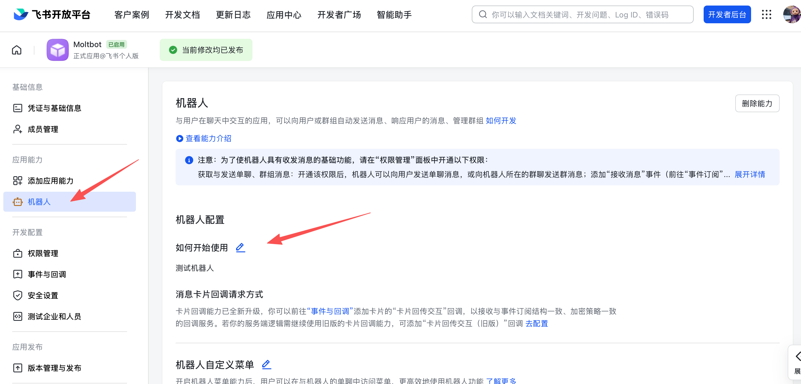
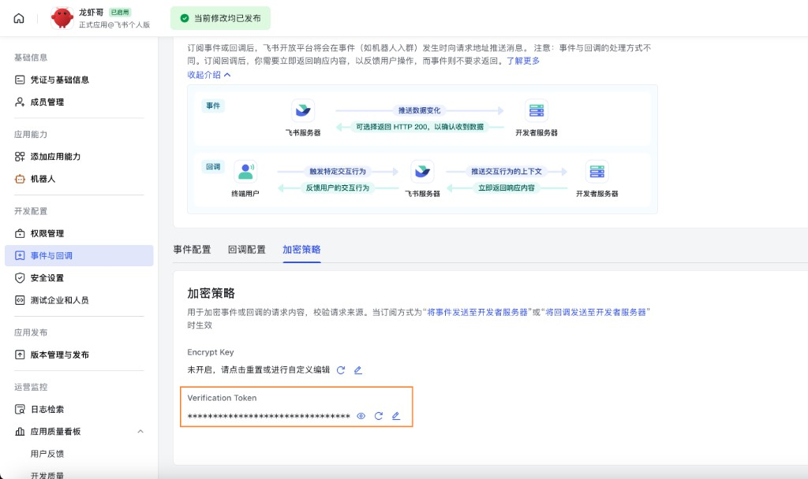

# Feishu bot

Feishu (Lark) は、企業でのメッセージングやコラボレーションに使われるチームチャットプラットフォームです。このプラグインは、Feishu / Lark の WebSocket イベントサブスクリプションを使って OpenClaw をボットへ接続します。そのため、公開 webhook URL を外部へ公開せずにメッセージを受信できます。

---

## Bundled plugin

Feishu は現在の OpenClaw リリースに同梱されているため、通常は別途プラグインをインストールする必要はありません。

ただし、同梱版を含まない古いビルドやカスタムインストールを使っている場合は、手動でインストールしてください。

```bash
openclaw plugins install @openclaw/feishu
```

---

## Quickstart

Feishu チャンネルの追加方法は 2 つあります。

### Method 1: onboarding wizard (recommended)

OpenClaw をインストールした直後であれば、ウィザードを実行してください。

```bash
openclaw onboard
```

ウィザードでは次を順に案内します。

1. Feishu アプリを作成し、認証情報を取得する
2. OpenClaw にアプリ認証情報を設定する
3. ゲートウェイを起動する

✅ **設定後** は、ゲートウェイの状態を確認してください。

- `openclaw gateway status`
- `openclaw logs --follow`

### Method 2: CLI setup

初期セットアップがすでに完了している場合は、CLI からチャンネルを追加できます。

```bash
openclaw channels add
```

**Feishu** を選択し、App ID と App Secret を入力します。

✅ **設定後** は、次のコマンドでゲートウェイを管理できます。

- `openclaw gateway status`
- `openclaw gateway restart`
- `openclaw logs --follow`

---

## Step 1: Create a Feishu app

### 1. Open Feishu Open Platform

[Feishu Open Platform](https://open.feishu.cn/app) を開いてサインインします。

Lark (グローバル) テナントを使う場合は [https://open.larksuite.com/app](https://open.larksuite.com/app) を開き、Feishu の設定で `domain: "lark"` を指定してください。

### 2. Create an app

1. **Create enterprise app** をクリックします。
2. アプリ名と説明を入力します。
3. アプリアイコンを選択します。


### 3. Copy credentials

**Credentials & Basic Info** から次の値を控えます。

- **App ID** (形式: `cli_xxx`)
- **App Secret**

❗ **Important:** App Secret は秘密として扱ってください。


### 4. Configure permissions

**Permissions** で **Batch import** をクリックし、次の内容を貼り付けます。

```json
{
  "scopes": {
    "tenant": [
      "aily:file:read",
      "aily:file:write",
      "application:application.app_message_stats.overview:readonly",
      "application:application:self_manage",
      "application:bot.menu:write",
      "cardkit:card:read",
      "cardkit:card:write",
      "contact:user.employee_id:readonly",
      "corehr:file:download",
      "event:ip_list",
      "im:chat.access_event.bot_p2p_chat:read",
      "im:chat.members:bot_access",
      "im:message",
      "im:message.group_at_msg:readonly",
      "im:message.p2p_msg:readonly",
      "im:message:readonly",
      "im:message:send_as_bot",
      "im:resource"
    ],
    "user": ["aily:file:read", "aily:file:write", "im:chat.access_event.bot_p2p_chat:read"]
  }
}
```


### 5. Enable bot capability

**App Capability** > **Bot** で次を設定します。

1. ボット機能を有効にする
2. ボット名を設定する



### 6. Configure event subscription

⚠️ **Important:** イベントサブスクリプションを設定する前に、次の 2 点を確認してください。

1. Feishu に対して `openclaw channels add` をすでに実行済みであること
2. ゲートウェイが起動していること (`openclaw gateway status`)

**Event Subscription** では次を設定します。

1. **Use long connection to receive events** (WebSocket) を選択する
2. `im.message.receive_v1` イベントを追加する

⚠️ ゲートウェイが起動していない場合、長時間接続の設定保存に失敗することがあります。


### 7. Publish the app

1. **Version Management & Release** でバージョンを作成します。
2. レビューへ提出して公開します。
3. 管理者承認を待ちます。enterprise app では自動承認されることが一般的です。

---

## Step 2: Configure OpenClaw

### Configure with the wizard (recommended)

```bash
openclaw channels add
```

**Feishu** を選択し、App ID と App Secret を貼り付けます。

### Configure via config file

`~/.openclaw/openclaw.json` を編集します。

```json5
{
  channels: {
    feishu: {
      enabled: true,
      dmPolicy: "pairing",
      accounts: {
        main: {
          appId: "cli_xxx",
          appSecret: "xxx",
          botName: "My AI assistant",
        },
      },
    },
  },
}
```

`connectionMode: "webhook"` を使う場合は `verificationToken` を設定してください。Feishu の webhook サーバーはデフォルトで `127.0.0.1` に bind されます。意図的に別の bind address が必要な場合にだけ `webhookHost` を設定してください。

#### Verification Token (webhook mode)

webhook モードを使う場合は、設定で `channels.feishu.verificationToken` を指定します。取得手順は次のとおりです。

1. Feishu Open Platform で対象アプリを開きます。
2. **Development** → **Events & Callbacks** (开发配置 → 事件与回调) を開きます。
3. **Encryption** タブ (加密策略) を開きます。
4. **Verification Token** をコピーします。



### Configure via environment variables

```bash
export FEISHU_APP_ID="cli_xxx"
export FEISHU_APP_SECRET="xxx"
```

### Lark (global) domain

テナントが Lark (国際版) にある場合は、domain を `lark` に設定してください。完全なドメイン文字列を指定することもできます。設定先は `channels.feishu.domain` またはアカウント単位の `channels.feishu.accounts.<id>.domain` です。

```json5
{
  channels: {
    feishu: {
      domain: "lark",
      accounts: {
        main: {
          appId: "cli_xxx",
          appSecret: "xxx",
        },
      },
    },
  },
}
```

### Quota optimization flags

Feishu API の利用量を減らしたい場合は、次の 2 つのオプションフラグを使えます。

- `typingIndicator` (デフォルト `true`): `false` にすると、入力中リアクションの API 呼び出しを省略します。
- `resolveSenderNames` (デフォルト `true`): `false` にすると、送信者プロフィール解決の API 呼び出しを省略します。

これらはトップレベル、またはアカウント単位で設定できます。

```json5
{
  channels: {
    feishu: {
      typingIndicator: false,
      resolveSenderNames: false,
      accounts: {
        main: {
          appId: "cli_xxx",
          appSecret: "xxx",
          typingIndicator: true,
          resolveSenderNames: false,
        },
      },
    },
  },
}
```

---

## Step 3: Start + test

### 1. Start the gateway

```bash
openclaw gateway
```

### 2. Send a test message

Feishu 上でボットを探し、テストメッセージを送信します。

### 3. Approve pairing

デフォルトでは、ボットはペアリングコードを返します。次のコマンドで承認します。

```bash
openclaw pairing approve feishu <CODE>
```

承認後は通常どおりチャットできます。

---

## Overview

- **Feishu bot channel**: ゲートウェイが管理する Feishu ボットチャンネルです。
- **Deterministic routing**: 返信は常に Feishu へ戻ります。
- **Session isolation**: DM は main session を共有し、グループは分離されます。
- **WebSocket connection**: Feishu SDK を使う長時間接続で動作し、公開 URL は不要です。

---

## Access control

### Direct messages

- **デフォルト**: `dmPolicy: "pairing"`。未知のユーザーにはペアリングコードが返されます。
- **ペアリング承認**:

  ```bash
  openclaw pairing list feishu
  openclaw pairing approve feishu <CODE>
  ```

- **allowlist モード**: `channels.feishu.allowFrom` に許可する Open ID を設定します。

### Group chats

**1. Group policy** (`channels.feishu.groupPolicy`)

- `"open"` = グループ内の全員を許可します (デフォルト)
- `"allowlist"` = `groupAllowFrom` に含まれるものだけを許可します
- `"disabled"` = グループメッセージを無効化します

**2. Mention requirement** (`channels.feishu.groups.<chat_id>.requireMention`)

- `true` = @mention 必須 (デフォルト)
- `false` = メンションなしでも応答

---

## Group configuration examples

### Allow all groups, require @mention (default)

```json5
{
  channels: {
    feishu: {
      groupPolicy: "open",
      // Default requireMention: true
    },
  },
}
```

### Allow all groups, no @mention required

```json5
{
  channels: {
    feishu: {
      groups: {
        oc_xxx: { requireMention: false },
      },
    },
  },
}
```

### Allow specific groups only

```json5
{
  channels: {
    feishu: {
      groupPolicy: "allowlist",
      // Feishu group IDs (chat_id) look like: oc_xxx
      groupAllowFrom: ["oc_xxx", "oc_yyy"],
    },
  },
}
```

### Restrict which senders can message in a group (sender allowlist)

グループ自体を許可するだけでなく、そのグループ内の **すべてのメッセージ** を送信者の `open_id` で制限できます。`groups.<chat_id>.allowFrom` に含まれるユーザーのメッセージだけが処理され、それ以外のメンバーからのメッセージは無視されます。これは `/reset` や `/new` のような制御コマンドだけでなく、通常のメッセージにも適用されます。

```json5
{
  channels: {
    feishu: {
      groupPolicy: "allowlist",
      groupAllowFrom: ["oc_xxx"],
      groups: {
        oc_xxx: {
          // Feishu user IDs (open_id) look like: ou_xxx
          allowFrom: ["ou_user1", "ou_user2"],
        },
      },
    },
  },
}
```

---

## Get group/user IDs

### Group IDs (chat_id)

グループ ID は `oc_xxx` のような形式です。

**Method 1 (recommended)**

1. ゲートウェイを起動し、グループ内でボットを @mention します。
2. `openclaw logs --follow` を実行し、`chat_id` を探します。

**Method 2**

Feishu API debugger を使ってグループチャット一覧を確認します。

### User IDs (open_id)

ユーザー ID は `ou_xxx` のような形式です。

**Method 1 (recommended)**

1. ゲートウェイを起動し、ボットへ DM を送ります。
2. `openclaw logs --follow` を実行し、`open_id` を探します。

**Method 2**

ペアリング要求一覧からユーザーの Open ID を確認します。

```bash
openclaw pairing list feishu
```

---

## Common commands

| Command   | Description       |
| --------- | ----------------- |
| `/status` | ボットの状態を表示 |
| `/reset`  | セッションをリセット |
| `/model`  | モデルの表示 / 切り替え |

> Note: Feishu は現時点でネイティブなコマンドメニューをサポートしていないため、コマンドはテキストとして送信する必要があります。

## Gateway management commands

| Command                    | Description                   |
| -------------------------- | ----------------------------- |
| `openclaw gateway status`  | ゲートウェイ状態を表示 |
| `openclaw gateway install` | ゲートウェイサービスをインストール / 起動 |
| `openclaw gateway stop`    | ゲートウェイサービスを停止 |
| `openclaw gateway restart` | ゲートウェイサービスを再起動 |
| `openclaw logs --follow`   | ゲートウェイログを追跡 |

---

## Troubleshooting

### Bot does not respond in group chats

1. ボットがグループへ追加されていることを確認します。
2. デフォルト挙動では @mention が必要です。メンションしているか確認します。
3. `groupPolicy` が `"disabled"` になっていないことを確認します。
4. `openclaw logs --follow` でログを確認します。

### Bot does not receive messages

1. アプリが公開済みかつ承認済みであることを確認します。
2. イベントサブスクリプションに `im.message.receive_v1` が含まれていることを確認します。
3. **long connection** が有効であることを確認します。
4. アプリ権限が不足していないことを確認します。
5. ゲートウェイが起動していることを確認します: `openclaw gateway status`
6. `openclaw logs --follow` でログを確認します。

### App Secret leak

1. Feishu Open Platform 上で App Secret をリセットします。
2. 設定内の App Secret を更新します。
3. ゲートウェイを再起動します。

### Message send failures

1. アプリに `im:message:send_as_bot` 権限があることを確認します。
2. アプリが公開済みであることを確認します。
3. ログで詳細エラーを確認します。

---

## Advanced configuration

### Multiple accounts

```json5
{
  channels: {
    feishu: {
      defaultAccount: "main",
      accounts: {
        main: {
          appId: "cli_xxx",
          appSecret: "xxx",
          botName: "Primary bot",
        },
        backup: {
          appId: "cli_yyy",
          appSecret: "yyy",
          botName: "Backup bot",
          enabled: false,
        },
      },
    },
  },
}
```

`defaultAccount` は、送信 API で `accountId` を明示しない場合に、どの Feishu アカウントを使うかを決めます。

### Message limits

- `textChunkLimit`: 送信テキストのチャンクサイズ (デフォルト 2000 文字)
- `mediaMaxMb`: メディアのアップロード / ダウンロード上限 (デフォルト 30 MB)

### Streaming

Feishu は interactive card を使ったストリーミング返信に対応しています。有効にすると、ボットはテキスト生成中にカードを更新します。

```json5
{
  channels: {
    feishu: {
      streaming: true, // enable streaming card output (default true)
      blockStreaming: true, // enable block-level streaming (default true)
    },
  },
}
```

送信前に完全な返信が揃うまで待たせたい場合は、`streaming: false` を設定してください。

### Multi-agent routing

`bindings` を使うと、Feishu の DM やグループを別のエージェントへルーティングできます。

```json5
{
  agents: {
    list: [
      { id: "main" },
      {
        id: "clawd-fan",
        workspace: "/home/user/clawd-fan",
        agentDir: "/home/user/.openclaw/agents/clawd-fan/agent",
      },
      {
        id: "clawd-xi",
        workspace: "/home/user/clawd-xi",
        agentDir: "/home/user/.openclaw/agents/clawd-xi/agent",
      },
    ],
  },
  bindings: [
    {
      agentId: "main",
      match: {
        channel: "feishu",
        peer: { kind: "direct", id: "ou_xxx" },
      },
    },
    {
      agentId: "clawd-fan",
      match: {
        channel: "feishu",
        peer: { kind: "direct", id: "ou_yyy" },
      },
    },
    {
      agentId: "clawd-xi",
      match: {
        channel: "feishu",
        peer: { kind: "group", id: "oc_zzz" },
      },
    },
  ],
}
```

主なルーティングフィールド:

- `match.channel`: `"feishu"`
- `match.peer.kind`: `"direct"` または `"group"`
- `match.peer.id`: ユーザー Open ID (`ou_xxx`) またはグループ ID (`oc_xxx`)

取得方法のヒントは [Get group/user IDs](#get-groupuser-ids) を参照してください。

---

## Configuration reference

完全な設定一覧: [Gateway configuration](/gateway/configuration)

| Setting                                           | Description                             | Default          |
| ------------------------------------------------- | --------------------------------------- | ---------------- |
| `channels.feishu.enabled`                         | チャンネルの有効 / 無効                  | `true`           |
| `channels.feishu.domain`                          | API ドメイン (`feishu` または `lark`)    | `feishu`         |
| `channels.feishu.connectionMode`                  | イベント転送モード                       | `websocket`      |
| `channels.feishu.defaultAccount`                  | 送信ルーティング時のデフォルトアカウント | `default`        |
| `channels.feishu.verificationToken`               | webhook モードで必須                     | -                |
| `channels.feishu.webhookPath`                     | webhook のルートパス                     | `/feishu/events` |
| `channels.feishu.webhookHost`                     | webhook の bind host                     | `127.0.0.1`      |
| `channels.feishu.webhookPort`                     | webhook の bind port                     | `3000`           |
| `channels.feishu.accounts.<id>.appId`             | App ID                                  | -                |
| `channels.feishu.accounts.<id>.appSecret`         | App Secret                              | -                |
| `channels.feishu.accounts.<id>.domain`            | アカウント単位の API ドメイン上書き      | `feishu`         |
| `channels.feishu.dmPolicy`                        | DM ポリシー                              | `pairing`        |
| `channels.feishu.allowFrom`                       | DM allowlist (`open_id` 一覧)            | -                |
| `channels.feishu.groupPolicy`                     | グループポリシー                         | `open`           |
| `channels.feishu.groupAllowFrom`                  | グループ allowlist                       | -                |
| `channels.feishu.groups.<chat_id>.requireMention` | @mention 必須かどうか                    | `true`           |
| `channels.feishu.groups.<chat_id>.enabled`        | グループを有効にするか                   | `true`           |
| `channels.feishu.textChunkLimit`                  | メッセージのチャンクサイズ               | `2000`           |
| `channels.feishu.mediaMaxMb`                      | メディアサイズ上限                       | `30`             |
| `channels.feishu.streaming`                       | ストリーミングカード出力を有効化         | `true`           |
| `channels.feishu.blockStreaming`                  | ブロックストリーミングを有効化           | `true`           |

---

## dmPolicy reference

| Value         | Behavior                                                        |
| ------------- | --------------------------------------------------------------- |
| `"pairing"`   | **デフォルト。** 未知のユーザーにはペアリングコードが返り、承認が必要です |
| `"allowlist"` | `allowFrom` に含まれるユーザーだけが利用できます               |
| `"open"`      | すべてのユーザーを許可します (`allowFrom` に `"*"` が必要)     |
| `"disabled"`  | DM を無効化します                                               |

---

## Supported message types

### Receive

- ✅ Text
- ✅ Rich text (post)
- ✅ Images
- ✅ Files
- ✅ Audio
- ✅ Video
- ✅ Stickers

### Send

- ✅ Text
- ✅ Images
- ✅ Files
- ✅ Audio
- ⚠️ Rich text (partial support)
