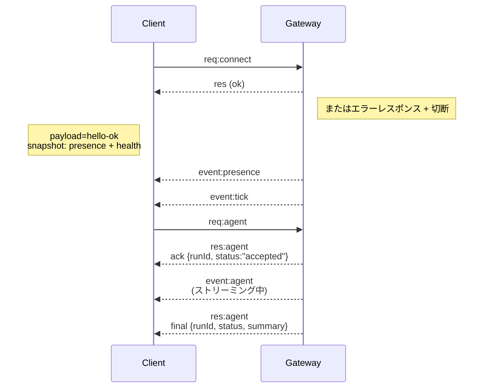

最終更新日: 2026-01-22

## 概要

- 単一の常駐プロセスである **ゲートウェイ** が、すべてのメッセージングインターフェース（Baileys による WhatsApp、grammY による Telegram、Slack、Discord、Signal、iMessage、WebChat）を管理します。
- コントロールプレーンクライアント（macOS アプリ、CLI、Web UI、自動化ツール）は、設定されたホストとポート（デフォルトは `127.0.0.1:18789`）で動作するゲートウェイに **WebSocket** 経由で接続します。
- **ノード** (macOS/iOS/Android/ヘッドレス) も同様に **WebSocket** で接続しますが、接続時に明示的な機能やコマンドと共に `role: node` を宣言します。
- 1 つのホストにつきゲートウェイは 1 つだけ実行されます。WhatsApp セッションを開始できるのはゲートウェイのみです。
- **キャンバスホスト**は、ゲートウェイと同じポート（デフォルト `18789`）を使用して、以下のパスで HTTP 配信されます:
  - `/__openclaw__/canvas/` (エージェントが編集可能な HTML/CSS/JS)
  - `/__openclaw__/a2ui/` (A2UI ホスト)

## コンポーネントとフロー

### ゲートウェイ (デーモン)

- 各プロバイダーとの接続を維持します。
- 型定義された WebSocket API (リクエスト、レスポンス、サーバープッシュイベント) を提供します。
- 受信したフレームを JSON スキーマに照らして検証します。
- `agent`, `chat`, `presence`, `health`, `heartbeat`, `cron` などのイベントを発行します。

### クライアント (mac アプリ / CLI / Web 管理画面)

- クライアントごとに 1 つの WebSocket 接続を確立します。
- リクエスト (`health`, `status`, `send`, `agent`, `system-presence`) を送信します。
- イベント (`tick`, `agent`, `presence`, `shutdown`) を購読します。

### ノード (macOS / iOS / Android / ヘッドレス)

- **同じ WebSocket サーバー**に `role: node` として接続します。
- `connect` 時にデバイスのアイデンティティを提供します。ペアリングは **デバイスベース** (role `node`) で行われ、その承認情報はデバイスペアリングストアで管理されます。
- `canvas.*`, `camera.*`, `screen.record`, `location.get` などのコマンドを公開します。

プロトコルの詳細:
- [ゲートウェイプロトコル](/gateway/protocol)

### WebChat

- ゲートウェイの WebSocket API を使用して会話履歴の表示や送信を行う、静的な UI です。
- リモート環境では、他のクライアントと同様に SSH や Tailscale トンネルを介して接続します。

## 接続ライフサイクル (単一クライアント)



## 通信プロトコル (サマリー)

- トランスポート: WebSocket。JSON ペイロードを含むテキストフレームを使用します。
- 最初のフレームは**必ず** `connect` である必要があります。
- ハンドシェイク（接続確立）後:
  - リクエスト: `{type:"req", id, method, params}` → `{type:"res", id, ok, payload|error}`
  - イベント: `{type:"event", event, payload, seq?, stateVersion?}`
- `OPENCLAW_GATEWAY_TOKEN` (または `--token`) が設定されている場合、`connect.params.auth.token` が一致しなければソケットは即座に閉じられます。
- 副作用を伴うメソッド (`send`, `agent`) では、安全に再試行を行うために冪等（べきとう）キーが必要です。サーバーは短期間の重複排除キャッシュを維持します。
- ノードは、`connect` 時に `role: "node"` に加え、利用可能な機能、コマンド、および権限を含める必要があります。

## ペアリングとローカルの信頼

- すべての WebSocket クライアント（オペレーターおよびノード）は、`connect` 時に **デバイスアイデンティティ** を含めます。
- 新しいデバイス ID にはペアリングの承認が必要で、ゲートウェイはそれ以降の接続のために **デバイストークン** を発行します。
- **ローカル**な接続（ループバックアドレス、またはゲートウェイホスト自身の Tailscale アドレス）は、同一ホスト内での利便性を保つため、自動的に承認される場合があります。
- すべての接続において、`connect.challenge` ノンスへの署名が必要です。
- 署名ペイロード `v3` では、`platform` (プラットフォーム) と `deviceFamily` (デバイスファミリー) も紐付けられます。ゲートウェイは再接続時にペアリング済みのメタデータを固定し、メタデータに変更があった場合にはペアリングの再実行（修復）を求めます。
- **ローカル以外**からの接続には、引き続き明示的な承認が必要です。
- ゲートウェイ認証 (`gateway.auth.*`) は、ローカルかリモートかを問わず、**すべての**接続に適用されます。

詳細: [ゲートウェイプロトコル](/gateway/protocol), [ペアリング](/channels/pairing), [セキュリティ](/gateway/security)

## プロトコルの型定義とコード生成

- プロトコルは TypeBox スキーマによって定義されています。
- これらのスキーマから JSON スキーマが生成されます。
- 生成された JSON スキーマから Swift のモデルが作成されます。

## リモートアクセス

- 推奨される方法: Tailscale または VPN。
- 代替案: SSH トンネル

  ```bash
  ssh -N -L 18789:127.0.0.1:18789 user@host
  ```

- トンネル越しでも、同じハンドシェイクと認証トークンが適用されます。
- リモート設定では、WebSocket に対して TLS 設定やオプションのピン留めを有効にできます。

## 運用のスナップショット

- 起動: `openclaw gateway` (フォアグラウンド実行。ログは標準出力に出力されます)。
- ヘルスチェック: WebSocket 経由の `health` リクエスト (または `hello-ok` レスポンスに含まれる情報)。
- プロセス監視: 自動再起動のために launchd または systemd を使用します。

## 不変のルール

- ホストごとに単一のゲートウェイが、単一の Baileys (WhatsApp) セッションを管理します。
- ハンドシェイクは必須です。最初のフレームが有効な JSON でない、あるいは `connect` でない場合は強制的に切断されます。
- イベントの再送（リプレイ）は行われません。通信に欠落が生じた場合、クライアント側で情報を再取得する必要があります。
