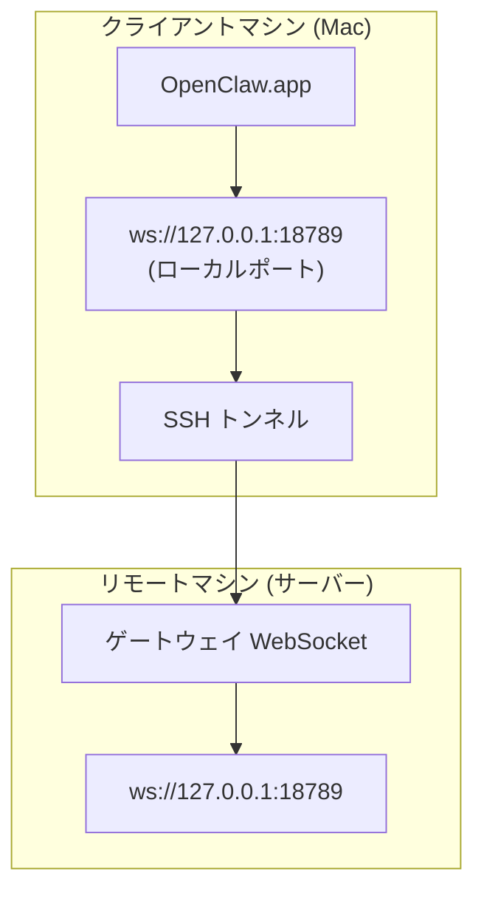

OpenClaw.app は、SSH トンネルを利用してリモートホスト上のゲートウェイに接続できます。本ガイドではその設定手順を説明します。

## 概要図



## クイックセットアップ

### ステップ 1: SSH 設定の追加

`~/.ssh/config` を編集して以下の内容を追加します:

```ssh
Host remote-gateway
    HostName <リモートIP>          # 例: 172.27.187.184
    User <リモートユーザー名>      # 例: jefferson
    LocalForward 18789 127.0.0.1:18789
    IdentityFile ~/.ssh/id_rsa
```

`<リモートIP>` と `<リモートユーザー名>` は自身の環境に合わせて置き換えてください。

### ステップ 2: SSH 公開鍵のコピー

公開鍵をリモートマシンにコピーします（初回のみパスワード入力が必要です）:

```bash
ssh-copy-id -i ~/.ssh/id_rsa <リモートユーザー名>@<リモートIP>
```

### ステップ 3: ゲートウェイトークンの設定

クライアント（Mac）側でトークンを環境変数として設定します:

```bash
launchctl setenv OPENCLAW_GATEWAY_TOKEN "<あなたのトークン>"
```

### ステップ 4: SSH トンネルの開始

```bash
ssh -N remote-gateway &
```

### ステップ 5: OpenClaw.app の再起動

```bash
# OpenClaw.app を一度終了 (⌘Q) し、再度開きます:
open /path/to/OpenClaw.app
```

これで、アプリは SSH トンネルを通じてリモートゲートウェイへ接続されるようになります。

---

## ログイン時のトンネル自動開始設定

Mac へのログイン時に SSH トンネルを自動で開始させるには、Launch Agent を作成します。

### PLIST ファイルの作成

以下の内容を `~/Library/LaunchAgents/ai.openclaw.ssh-tunnel.plist` として保存してください:

```xml
<?xml version="1.0" encoding="UTF-8"?>
<!DOCTYPE plist PUBLIC "-//Apple//DTD PLIST 1.0//EN" "http://www.apple.com/DTDs/PropertyList-1.0.dtd">
<plist version="1.0">
<dict>
    <key>Label</key>
    <string>ai.openclaw.ssh-tunnel</string>
    <key>ProgramArguments</key>
    <array>
        <string>/usr/bin/ssh</string>
        <string>-N</string>
        <string>remote-gateway</string>
    </array>
    <key>KeepAlive</key>
    <true/>
    <key>RunAtLoad</key>
    <true/>
</dict>
</plist>
```

### Launch Agent のロード

```bash
launchctl bootstrap gui/$UID ~/Library/LaunchAgents/ai.openclaw.ssh-tunnel.plist
```

これにより、トンネルは以下の挙動となります:
- ログイン時に自動起動。
- クラッシュした場合に自動再起動。
- バックグラウンドで常時稼働。

以前の設定（`com.openclaw.ssh-tunnel` など）が残っている場合は、あらかじめ削除しておいてください。

---

## トラブルシューティング

**トンネルが動いているか確認する:**

```bash
ps aux | grep "ssh -N remote-gateway" | grep -v grep
lsof -i :18789
```

**トンネルを再起動する:**

```bash
launchctl kickstart -k gui/$UID/ai.openclaw.ssh-tunnel
```

**トンネルを停止する:**

```bash
launchctl bootout gui/$UID/ai.openclaw.ssh-tunnel
```

---

## 仕組みの解説

| コンポーネント | 役割 |
| :--- | :--- |
| `LocalForward 18789 127.0.0.1:18789` | ローカルの 18789 ポートをリモートの 18789 ポートへ転送します。 |
| `ssh -N` | リモートでのコマンド実行を伴わず、ポート転送のみを行う SSH モードです。 |
| `KeepAlive` | プロセスが停止した場合に自動的に再起動させます。 |
| `RunAtLoad` | エージェントのロード時（ログイン時）に実行を開始します。 |

OpenClaw.app は自身のマシンの `ws://127.0.0.1:18789` へ接続を試みます。SSH トンネルがその通信を受け取り、実際にゲートウェイが動作しているリモートマシンの 18789 ポートへと転送します。
