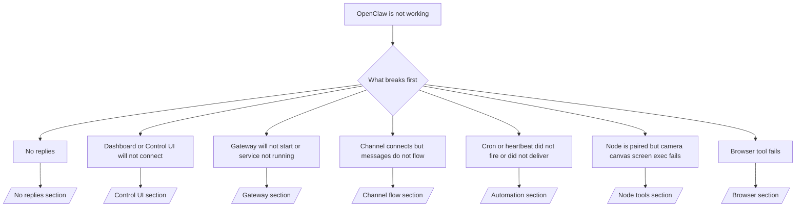

まず 2 分だけで状況を見たい場合は、このページをトリアージの入口として使ってください。

## 最初の 60 秒

次のコマンドを、この順序どおりに実行します。

```bash
openclaw status
openclaw status --all
openclaw gateway probe
openclaw gateway status
openclaw doctor
openclaw channels status --probe
openclaw logs --follow
```

良い状態の目安は次のとおりです。

- `openclaw status` → 設定済みチャネルが表示され、明らかな認証エラーが出ていない
- `openclaw status --all` → 完全なレポートが出力され、そのまま共有できる
- `openclaw gateway probe` → 想定しているゲートウェイ先に到達できる
- `openclaw gateway status` → `Runtime: running` と `RPC probe: ok` が出る
- `openclaw doctor` → 設定やサービスに致命的な問題がない
- `openclaw channels status --probe` → 各チャネルが `connected` または `ready` を返す
- `openclaw logs --follow` → 動作ログが継続して流れ、致命的なエラーが繰り返されない

## Anthropic の long context 429

次のエラーが出る場合:
`HTTP 429: rate_limit_error: Extra usage is required for long context requests`

[/gateway/troubleshooting#anthropic-429-extra-usage-required-for-long-context](/gateway/troubleshooting#anthropic-429-extra-usage-required-for-long-context) を参照してください。

## `openclaw.extensions` 欠落でプラグインインストールが失敗する

`package.json missing openclaw.extensions` でインストールに失敗する場合、そのプラグインパッケージは OpenClaw が現在受け付けない旧形式になっています。

プラグイン側で次を修正してください。

1. `package.json` に `openclaw.extensions` を追加する
2. エントリをビルド済みランタイムファイル（通常は `./dist/index.js`）へ向ける
3. プラグインを再公開し、`openclaw plugins install <npm-spec>` を再実行する

例:

```json
{
  "name": "@openclaw/my-plugin",
  "version": "1.2.3",
  "openclaw": {
    "extensions": ["./dist/index.js"]
  }
}
```

参考: [/tools/plugin#distribution-npm](/tools/plugin#distribution-npm)

## 判断フロー



<AccordionGroup>
  <Accordion title="返信が返ってこない">
    ```bash
    openclaw status
    openclaw gateway status
    openclaw channels status --probe
    openclaw pairing list --channel <channel> [--account <id>]
    openclaw logs --follow
    ```

    正常時の目安:

    - `Runtime: running`
    - `RPC probe: ok`
    - `channels status --probe` で対象チャネルが `connected` / `ready`
    - 送信者が承認済み、または DM ポリシーが open / allowlist

    よくあるログシグネチャ:

    - `drop guild message (mention required` → Discord でメンション必須の判定によりブロック
    - `pairing request` → 送信者が未承認で、DM のペアリング承認待ち
    - `blocked` / `allowlist` → 送信者、ルーム、グループのいずれかがフィルタされている

    詳細ページ:

    - [/gateway/troubleshooting#no-replies](/gateway/troubleshooting#no-replies)
    - [/channels/troubleshooting](/channels/troubleshooting)
    - [/channels/pairing](/channels/pairing)

  </Accordion>

  <Accordion title="Dashboard または Control UI が接続できない">
    ```bash
    openclaw status
    openclaw gateway status
    openclaw logs --follow
    openclaw doctor
    openclaw channels status --probe
    ```

    正常時の目安:

    - `openclaw gateway status` に `Dashboard: http://...` が表示される
    - `RPC probe: ok`
    - ログに認証ループがない

    よくあるログシグネチャ:

    - `device identity required` → HTTP / 非セキュアコンテキストではデバイス認証を完了できない
    - `unauthorized` / reconnect loop → トークンやパスワードが誤っている、または認証モードが一致していない
    - `gateway connect failed:` → UI が誤った URL / ポートを向いている、またはゲートウェイへ到達できない

    詳細ページ:

    - [/gateway/troubleshooting#dashboard-control-ui-connectivity](/gateway/troubleshooting#dashboard-control-ui-connectivity)
    - [/web/control-ui](/web/control-ui)
    - [/gateway/authentication](/gateway/authentication)

  </Accordion>

  <Accordion title="ゲートウェイが起動しない、またはサービス導入後に動作していない">
    ```bash
    openclaw status
    openclaw gateway status
    openclaw logs --follow
    openclaw doctor
    openclaw channels status --probe
    ```

    正常時の目安:

    - `Service: ... (loaded)`
    - `Runtime: running`
    - `RPC probe: ok`

    よくあるログシグネチャ:

    - `Gateway start blocked: set gateway.mode=local` → `gateway.mode` が未設定か `remote`
    - `refusing to bind gateway ... without auth` → 非ループバックへのバインドにトークンまたはパスワードが設定されていない
    - `another gateway instance is already listening` または `EADDRINUSE` → 既に別プロセスがそのポートを使用している

    詳細ページ:

    - [/gateway/troubleshooting#gateway-service-not-running](/gateway/troubleshooting#gateway-service-not-running)
    - [/gateway/background-process](/gateway/background-process)
    - [/gateway/configuration](/gateway/configuration)

  </Accordion>

  <Accordion title="チャネルは接続しているのにメッセージが流れない">
    ```bash
    openclaw status
    openclaw gateway status
    openclaw logs --follow
    openclaw doctor
    openclaw channels status --probe
    ```

    正常時の目安:

    - チャネルトランスポート自体は接続済み
    - ペアリングや allowlist の条件を満たしている
    - 必要な場面ではメンションが検出されている

    よくあるログシグネチャ:

    - `mention required` → グループでメンション必須の条件により処理されていない
    - `pairing` / `pending` → DM の送信者がまだ承認されていない
    - `not_in_channel`、`missing_scope`、`Forbidden`、`401/403` → チャネル権限やトークンの問題

    詳細ページ:

    - [/gateway/troubleshooting#channel-connected-messages-not-flowing](/gateway/troubleshooting#channel-connected-messages-not-flowing)
    - [/channels/troubleshooting](/channels/troubleshooting)

  </Accordion>

  <Accordion title="Cron または heartbeat が起動しない、または配信されない">
    ```bash
    openclaw status
    openclaw gateway status
    openclaw cron status
    openclaw cron list
    openclaw cron runs --id <jobId> --limit 20
    openclaw logs --follow
    ```

    正常時の目安:

    - `cron.status` で有効化済みかつ次回起動時刻が表示される
    - `cron runs` に最近の `ok` エントリがある
    - heartbeat が有効で、静音時間帯の外になっていない

    よくあるログシグネチャ:

    - `cron: scheduler disabled; jobs will not run automatically` → cron が無効
    - `heartbeat skipped` と `reason=quiet-hours` → 設定したアクティブ時間外
    - `requests-in-flight` → メインレーンが混雑しており、heartbeat の起動が後ろ倒し
    - `unknown accountId` → heartbeat の配信先 `accountId` が存在しない

    詳細ページ:

    - [/gateway/troubleshooting#cron-and-heartbeat-delivery](/gateway/troubleshooting#cron-and-heartbeat-delivery)
    - [/automation/troubleshooting](/automation/troubleshooting)
    - [/gateway/heartbeat](/gateway/heartbeat)

  </Accordion>

  <Accordion title="ノードはペアリング済みだが camera / canvas / screen / exec が失敗する">
    ```bash
    openclaw status
    openclaw gateway status
    openclaw nodes status
    openclaw nodes describe --node <idOrNameOrIp>
    openclaw logs --follow
    ```

    正常時の目安:

    - ノードが role `node` として接続済みかつペアリング済みで表示される
    - 実行しようとしているコマンドに対応する capability がある
    - そのツールに必要な権限が付与済みである

    よくあるログシグネチャ:

    - `NODE_BACKGROUND_UNAVAILABLE` → ノードアプリを前面に出す必要がある
    - `*_PERMISSION_REQUIRED` → OS 権限が未付与または拒否されている
    - `SYSTEM_RUN_DENIED: approval required` → `exec` の承認待ち
    - `SYSTEM_RUN_DENIED: allowlist miss` → コマンドが `exec` allowlist に含まれていない

    詳細ページ:

    - [/gateway/troubleshooting#node-paired-tool-fails](/gateway/troubleshooting#node-paired-tool-fails)
    - [/nodes/troubleshooting](/nodes/troubleshooting)
    - [/tools/exec-approvals](/tools/exec-approvals)

  </Accordion>

  <Accordion title="Browser ツールが失敗する">
    ```bash
    openclaw status
    openclaw gateway status
    openclaw browser status
    openclaw logs --follow
    openclaw doctor
    ```

    正常時の目安:

    - browser status に `running: true` と使用中のブラウザ / プロファイルが表示される
    - `openclaw` プロファイルが起動している、または `chrome` relay に接続済みタブがある

    よくあるログシグネチャ:

    - `Failed to start Chrome CDP on port` → ローカルブラウザの起動に失敗
    - `browser.executablePath not found` → 設定したバイナリパスが誤っている
    - `Chrome extension relay is running, but no tab is connected` → 拡張機能が接続されていない
    - `Browser attachOnly is enabled ... not reachable` → attach-only プロファイルにライブな CDP ターゲットがない

    詳細ページ:

    - [/gateway/troubleshooting#browser-tool-fails](/gateway/troubleshooting#browser-tool-fails)
    - [/tools/browser-linux-troubleshooting](/tools/browser-linux-troubleshooting)
    - [/tools/browser-wsl2-windows-remote-cdp-troubleshooting](/tools/browser-wsl2-windows-remote-cdp-troubleshooting)
    - [/tools/chrome-extension](/tools/chrome-extension)

  </Accordion>
</AccordionGroup>
