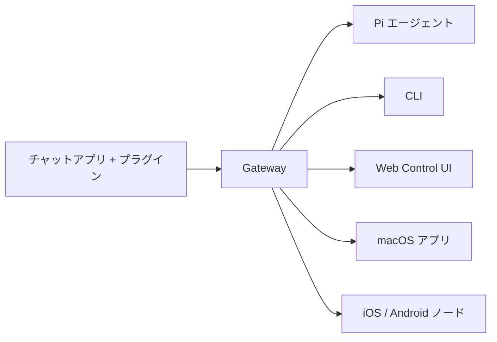

# OpenClaw 🦞

<p align="center">
    
    
</p>

> _「EXFOLIATE! EXFOLIATE!」_ — たぶん宇宙ロブスター

<p align="center">
  <strong>WhatsApp、Telegram、Discord、iMessage などをまたぐ AI エージェント向けのあらゆる OS 対応 Gateway。</strong><br />
  メッセージを送るだけで、ポケットからエージェントの応答が届きます。プラグインで Mattermost なども追加可能です。
</p>

<Columns>
  <Card title="はじめに" href="/start/getting-started" icon="rocket">
    OpenClaw をインストールし、数分で Gateway を起動できます。
  </Card>
  <Card title="ウィザードを実行する" href="/start/wizard" icon="sparkles">
    `openclaw onboard` とペアリングフローによるガイド付きセットアップ。
  </Card>
  <Card title="Control UI を開く" href="/web/control-ui" icon="layout-dashboard">
    チャット、設定、セッション管理用のブラウザダッシュボードを起動します。
  </Card>
</Columns>

## OpenClaw とは？

OpenClaw は、お気に入りのチャットアプリ — WhatsApp、Telegram、Discord、iMessage など — を Pi のような AI コーディングエージェントに接続する**セルフホスト型 Gateway** です。自分のマシン（またはサーバー）上で単一の Gateway プロセスを実行するだけで、メッセージングアプリと常時利用可能な AI アシスタントの橋渡しになります。

**誰のためのもの？** どこからでもメッセージを送れるパーソナル AI アシスタントが欲しいけれど、データの管理権を手放したくない、ホスト型サービスに依存したくない開発者やパワーユーザー向けです。

**何が違うのか？**

- **セルフホスト型**: 自分のハードウェアで動作し、自分のルールで運用
- **マルチチャンネル**: 1 つの Gateway で WhatsApp、Telegram、Discord などを同時に提供
- **エージェントネイティブ**: ツール使用、セッション、メモリ、マルチエージェントルーティングを備えたコーディングエージェント向けに構築
- **オープンソース**: MIT ライセンス、コミュニティ主導

**何が必要？** Node 22 以上、選択したプロバイダーの API キー、そして 5 分間。最高の品質とセキュリティのために、利用可能な最新世代の最も強力なモデルを使用してください。

## 仕組み



Gateway は、セッション、ルーティング、チャンネル接続の単一の信頼できる情報源です。

## 主な機能

<Columns>
  <Card title="マルチチャンネル Gateway" icon="network">
    単一の Gateway プロセスで WhatsApp、Telegram、Discord、iMessage に対応。
  </Card>
  <Card title="プラグインチャンネル" icon="plug">
    拡張パッケージで Mattermost などを追加。
  </Card>
  <Card title="マルチエージェントルーティング" icon="route">
    エージェント、ワークスペース、送信者ごとに分離されたセッション。
  </Card>
  <Card title="メディアサポート" icon="image">
    画像、音声、ドキュメントの送受信。
  </Card>
  <Card title="Web Control UI" icon="monitor">
    チャット、設定、セッション、ノード管理用のブラウザダッシュボード。
  </Card>
  <Card title="モバイルノード" icon="smartphone">
    iOS / Android ノードをペアリングして、Canvas、カメラ、音声対応ワークフローを実現。
  </Card>
</Columns>

## クイックスタート

<Steps>
  <Step title="OpenClaw をインストール">
    ```bash
    npm install -g openclaw@latest
    ```
  </Step>
  <Step title="オンボーディングとサービスのインストール">
    ```bash
    openclaw onboard --install-daemon
    ```
  </Step>
  <Step title="WhatsApp をペアリングして Gateway を起動">
    ```bash
    openclaw channels login
    openclaw gateway --port 18789
    ```
  </Step>
</Steps>

完全なインストールと開発セットアップが必要ですか？[クイックスタート](/start/quickstart)を参照してください。

## ダッシュボード

Gateway の起動後にブラウザで Control UI を開きます。

- ローカルデフォルト: [http://127.0.0.1:18789/](http://127.0.0.1:18789/)
- リモートアクセス: [Web サーフェス](/web)および [Tailscale](/gateway/tailscale)

<p align="center">
  
</p>

## 設定（オプション）

設定ファイルは `~/.openclaw/openclaw.json` にあります。

- **何もしなければ**、OpenClaw は送信者ごとのセッションで RPC モードのバンドル済み Pi バイナリを使用します。
- ロックダウンしたい場合は、`channels.whatsapp.allowFrom` と（グループの場合は）メンションルールから始めてください。

例:

```json5
{
  channels: {
    whatsapp: {
      allowFrom: ["+15555550123"],
      groups: { "*": { requireMention: true } },
    },
  },
  messages: { groupChat: { mentionPatterns: ["@openclaw"] } },
}
```

## ここから始めましょう

<Columns>
  <Card title="ドキュメントハブ" href="/start/hubs" icon="book-open">
    ユースケース別に整理されたすべてのドキュメントとガイド。
  </Card>
  <Card title="設定" href="/gateway/configuration" icon="settings">
    Gateway のコア設定、トークン、プロバイダー設定。
  </Card>
  <Card title="リモートアクセス" href="/gateway/remote" icon="globe">
    SSH および tailnet アクセスパターン。
  </Card>
  <Card title="チャンネル" href="/channels/telegram" icon="message-square">
    WhatsApp、Telegram、Discord などのチャンネル固有のセットアップ。
  </Card>
  <Card title="ノード" href="/nodes" icon="smartphone">
    ペアリング、Canvas、カメラ、デバイスアクションを備えた iOS / Android ノード。
  </Card>
  <Card title="ヘルプ" href="/help" icon="life-buoy">
    よくある修正方法とトラブルシューティングの入口。
  </Card>
</Columns>

## さらに詳しく

<Columns>
  <Card title="全機能一覧" href="/concepts/features" icon="list">
    チャンネル、ルーティング、メディア機能の完全なリスト。
  </Card>
  <Card title="マルチエージェントルーティング" href="/concepts/multi-agent" icon="route">
    ワークスペースの分離とエージェントごとのセッション。
  </Card>
  <Card title="セキュリティ" href="/gateway/security" icon="shield">
    トークン、許可リスト、安全管理。
  </Card>
  <Card title="トラブルシューティング" href="/gateway/troubleshooting" icon="wrench">
    Gateway の診断とよくあるエラー。
  </Card>
  <Card title="概要とクレジット" href="/reference/credits" icon="info">
    プロジェクトの起源、コントリビューター、ライセンス。
  </Card>
</Columns>
