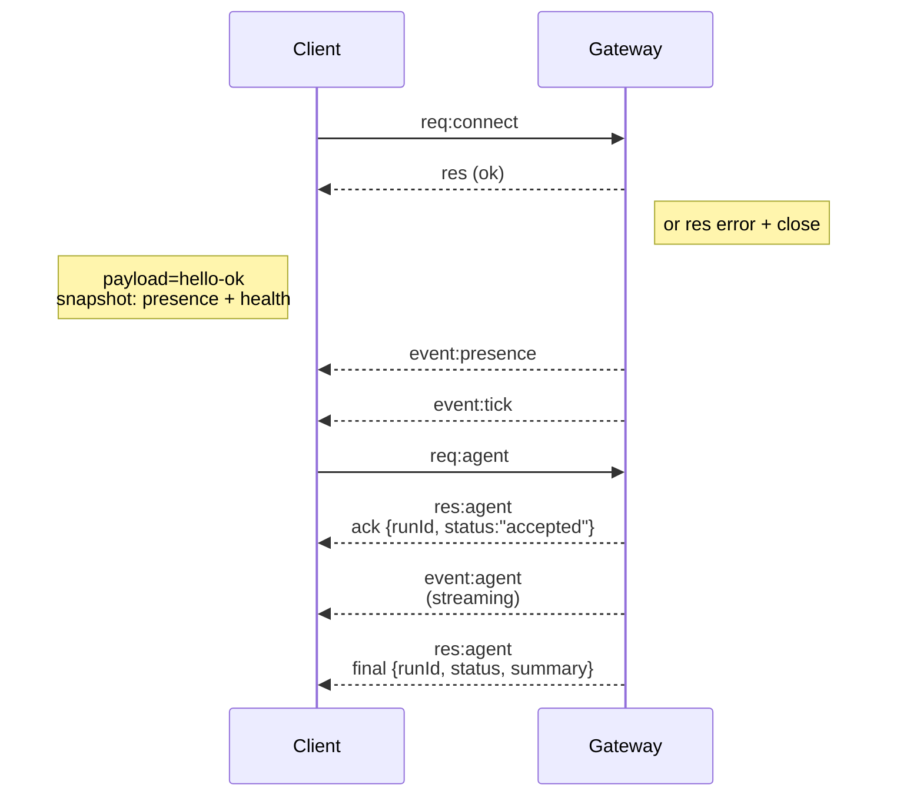

# ゲートウェイアーキテクチャ

最終更新日: 2026-01-22

## 概要

- 単一の長命 **ゲートウェイ** がすべてのメッセージング サーフェイス (WhatsApp 経由) を所有します。
  Baileys、grammY 経由のテレグラム、Slack、Discord、Signal、iMessage、WebChat)。
- コントロール プレーン クライアント (macOS アプリ、CLI、Web UI、オートメーション) は、
  構成されたバインド ホスト上の **WebSocket** 上のゲートウェイ (デフォルト)
  `127.0.0.1:18789`)。
- **ノード** (macOS/iOS/Android/ヘッドレス) も **WebSocket** 経由で接続しますが、
  明示的なキャップ/コマンドを使用して `role: node` を宣言します。
- ホストごとに 1 つのゲートウェイ。 WhatsApp セッションを開く唯一の場所です。
- **キャンバス ホスト**は、次のゲートウェイ HTTP サーバーによって提供されます。
  - `/__openclaw__/canvas/` (エージェントが編集可能な HTML/CSS/JS)
  - `/__openclaw__/a2ui/` (A2UI ホスト)
    ゲートウェイと同じポートを使用します (デフォルトは `18789`)。

## コンポーネントとフロー

### ゲートウェイ (デーモン)

- プロバイダー接続を維持します。
- 型付き WS API (リクエスト、レスポンス、サーバープッシュ イベント) を公開します。
- JSON スキーマに対して受信フレームを検証します。
- `agent`、`chat`、`presence`、`health`、`heartbeat`、`cron` などのイベントを発行します。

### クライアント (Mac アプリ / CLI / Web 管理者)- クライアントごとに 1 つの WS 接続

- リクエストを送信します (`health`、`status`、`send`、`agent`、`system-presence`)。
- イベントを購読します (`tick`、`agent`、`presence`、`shutdown`)。

### ノード (macOS / iOS / Android / ヘッドレス)

- `role: node` を使用して **同じ WS サーバー** に接続します。
- `connect` でデバイス ID を指定します。ペアリングは **デバイスベース** (ロール `node`) であり、
  承認はデバイス ペアリング ストアにあります。
- `canvas.*`、`camera.*`、`screen.record`、`location.get` などのコマンドを公開します。

プロトコルの詳細:

- [ゲートウェイプロトコル](/gateway/protocol)

### ウェブチャット

- チャット履歴と送信に Gateway WS API を使用する静的 UI。
- リモート セットアップでは、他のセットアップと同じ SSH/Tailscale トンネルを介して接続します。
  クライアント。

## 接続ライフサイクル (単一クライアント)



## ワイヤープロトコル (概要)- トランスポート: WebSocket、JSON ペイロードを含むテキスト フレーム

- 最初のフレームは **必ず** `connect` です。
- 握手後:
  - リクエスト: `{type:"req", id, method, params}` → `{type:"res", id, ok, payload|error}`
  - イベント: `{type:"event", event, payload, seq?, stateVersion?}`
- `OPENCLAW_GATEWAY_TOKEN` (または `--token`) が設定されている場合、`connect.params.auth.token`
  一致する必要があります。一致しない場合はソケットが閉じます。
- 冪等キーは、副作用を引き起こすメソッド (`send`、`agent`) に必要です。
  安全に再試行してください。サーバーは有効期間の短い重複排除キャッシュを保持します。
- ノードには、`role: "node"` に加えて、`connect` のキャップ/コマンド/権限が含まれている必要があります。

## ペアリング + ローカル信頼

- すべての WS クライアント (オペレーター + ノード) には、`connect` の **デバイス ID** が含まれます。
- 新しいデバイス ID にはペアリングの承認が必要です。ゲートウェイは **デバイス トークン**を発行します
  後続の接続用。
- **ローカル** 接続 (ループバックまたはゲートウェイ ホスト自身のテールネット アドレス)
  同じホストの UX をスムーズに保つために自動承認されます。
- すべての接続は `connect.challenge` nonce に署名する必要があります。
- 署名ペイロード `v3` は `platform` + `deviceFamily` もバインドします。ゲートウェイ
  再接続時にペアになったメタデータを固定し、メタデータのペアリングを修復する必要がある
  変化します。
- **非ローカル**の接続には引き続き明示的な承認が必要です。
- ゲートウェイ認証 (`gateway.auth.*`) は、ローカル接続またはローカル接続のすべての接続に引き続き適用されます。
  リモート。

詳細: [ゲートウェイプロトコル](/gateway/protocol)、[ペアリング](/channels/pairing)、
[セキュリティ](/gateway/security)。## プロトコルの型指定とコード生成

- TypeBox スキーマはプロトコルを定義します。
- JSON スキーマはそれらのスキーマから生成されます。
- Swift モデルは JSON スキーマから生成されます。

## リモートアクセス

- 推奨: テールスケールまたは VPN。
- 代替: SSH トンネル

  ```bash
  ssh -N -L 18789:127.0.0.1:18789 user@host
  ```

- 同じハンドシェイク + 認証トークンがトンネル上に適用されます。
- リモート設定で WS に対して TLS + オプションのピンニングを有効にできます。

## 操作のスナップショット

- 開始: `openclaw gateway` (フォアグラウンド、標準出力にログ)。
- ヘルス: WS 経由の `health` (`hello-ok` にも含まれます)。
- 監視: 自動再起動用の launchd/systemd。

## 不変条件

- ホストごとに 1 つのゲートウェイが 1 つの Baileys セッションを制御します。
- ハンドシェイクは必須です。非 JSON または非接続の最初のフレームはハードクローズです。
- イベントは再生されません。クライアントはギャップを更新する必要があります。
