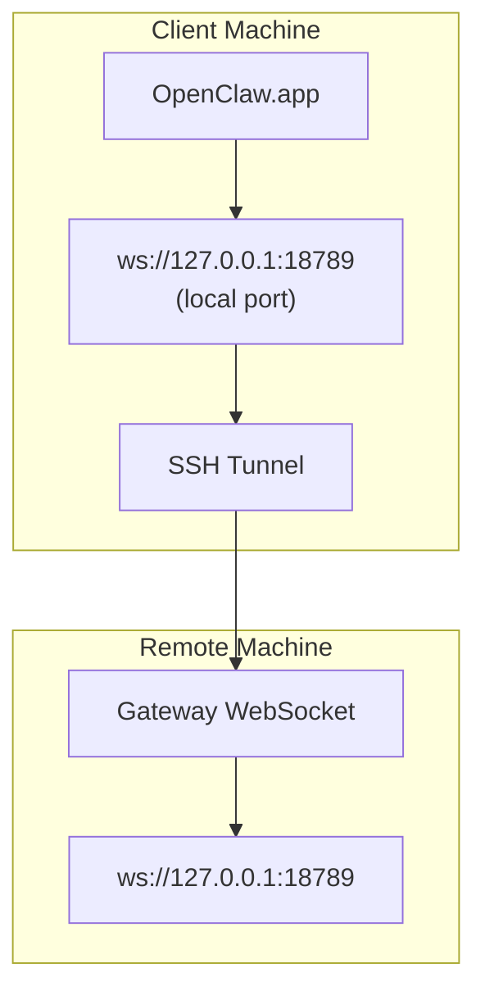

# リモートゲートウェイを使用して OpenClaw.app を実行する

OpenClaw.app は、SSH トンネリングを使用してリモート ゲートウェイに接続します。このガイドでは、その設定方法を説明します。

## 概要



## クイックセットアップ

### ステップ 1: SSH 構成を追加する

`~/.ssh/config` を編集して以下を追加します。

```ssh
Host remote-gateway
    HostName <REMOTE_IP>          # e.g., 172.27.187.184
    User <REMOTE_USER>            # e.g., jefferson
    LocalForward 18789 127.0.0.1:18789
    IdentityFile ~/.ssh/id_rsa
```

`<REMOTE_IP>` と `<REMOTE_USER>` を実際の値に置き換えます。

### ステップ 2: SSH キーをコピーする

公開キーをリモート マシンにコピーします (パスワードを 1 回入力します)。

```bash
ssh-copy-id -i ~/.ssh/id_rsa <REMOTE_USER>@<REMOTE_IP>
```

### ステップ 3: ゲートウェイ トークンを設定する

```bash
launchctl setenv OPENCLAW_GATEWAY_TOKEN "<your-token>"
```

### ステップ 4: SSH トンネルを開始する

```bash
ssh -N remote-gateway &
```

### ステップ 5: OpenClaw.app を再起動します

```bash
# Quit OpenClaw.app (⌘Q), then reopen:
open /path/to/OpenClaw.app
```

これで、アプリは SSH トンネル経由でリモート ゲートウェイに接続します。

---

## ログイン時にトンネルを自動開始する

ログイン時に SSH トンネルが自動的に開始されるようにするには、Launch Agent を作成します。

### PLIST ファイルを作成する

これを `~/Library/LaunchAgents/ai.openclaw.ssh-tunnel.plist` として保存します。

```xml
<?xml version="1.0" encoding="UTF-8"?>
<!DOCTYPE plist PUBLIC "-//Apple//DTD PLIST 1.0//EN" "http://www.apple.com/DTDs/PropertyList-1.0.dtd">
<plist version="1.0">
<dict>
    <key>Label</key>
    <string>ai.openclaw.ssh-tunnel</string>
    <key>ProgramArguments</key>
    <array>
        <string>/usr/bin/ssh</string>
        <string>-N</string>
        <string>remote-gateway</string>
    </array>
    <key>KeepAlive</key>
    <true/>
    <key>RunAtLoad</key>
    <true/>
</dict>
</plist>
```

### 起動エージェントをロードする

```bash
launchctl bootstrap gui/$UID ~/Library/LaunchAgents/ai.openclaw.ssh-tunnel.plist
```

トンネルは次のようになります。

- ログインすると自動的に起動します
- クラッシュした場合は再起動します
- バックグラウンドで実行し続ける

従来の注意: 残っている `com.openclaw.ssh-tunnel` LaunchAgent が存在する場合は削除します。

---

## トラブルシューティング

**トンネルが実行中かどうかを確認します:**

```bash
ps aux | grep "ssh -N remote-gateway" | grep -v grep
lsof -i :18789
```

**トンネルを再起動します:**

```bash
launchctl kickstart -k gui/$UID/ai.openclaw.ssh-tunnel
```

**トンネルを停止してください:**

```bash
launchctl bootout gui/$UID/ai.openclaw.ssh-tunnel
```

---

## 仕組み|コンポーネント |何をするのか |

| ------------------------------------ | -------------------------------------------------------------- |
| `LocalForward 18789 127.0.0.1:18789` |ローカル ポート 18789 をリモート ポート 18789 に転送します。
| `ssh -N` |リモート コマンドを実行せずに SSH (ポート転送のみ) |
| `KeepAlive` |トンネルがクラッシュした場合は自動的に再起動します。
| `RunAtLoad` |エージェントのロード時にトンネルを開始します。

OpenClaw.app はクライアント マシン上の `ws://127.0.0.1:18789` に接続します。 SSH トンネルは、その接続を、ゲートウェイが実行されているリモート マシンのポート 18789 に転送します。
