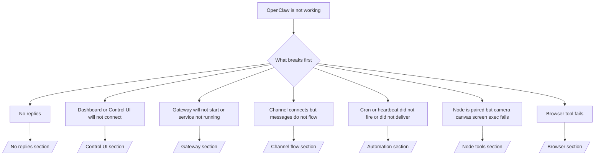

# トラブルシューティング

2 分しか時間がない場合は、このページをトリアージの入り口として使用してください。

## 最初の 60 秒

この正確なはしごを次の順序で実行します。

```bash
openclaw status
openclaw status --all
openclaw gateway probe
openclaw gateway status
openclaw doctor
openclaw channels status --probe
openclaw logs --follow
```

1 行で適切な出力が得られます。

- `openclaw status` → 設定されたチャネルが表示されますが、明らかな認証エラーはありません。
- `openclaw status --all` → 完全なレポートが存在し、共有可能です。
- `openclaw gateway probe` → 予想されるゲートウェイ ターゲットに到達可能です。
- `openclaw gateway status` → `Runtime: running` および `RPC probe: ok`。
- `openclaw doctor` → ブロックする構成/サービス エラーはありません。
- `openclaw channels status --probe` → チャネルは `connected` または `ready` をレポートします。
- `openclaw logs --follow` → 安定したアクティビティ、致命的なエラーの繰り返しなし。

## 人間的な長い文脈 429

表示された場合:
`HTTP 429: rate_limit_error: Extra usage is required for long context requests`、
[/gateway/troubleshooting#anthropic-429-extra-usage-required-for-long-context](/gateway/troubleshooting#anthropic-429-extra-usage-required-for-long-context) に移動します。

## openclaw 拡張機能が見つからないためプラグインのインストールが失敗する

インストールが `package.json missing openclaw.extensions` で失敗した場合、プラグイン パッケージ
OpenClaw が受け付けなくなった古い形状を使用しています。

プラグイン パッケージを修正します。

1. `openclaw.extensions` を `package.json` に追加します。
2. ビルドされたランタイム ファイル (通常は `./dist/index.js`) のエントリをポイントします。
3. プラグインを再公開し、`openclaw plugins install <npm-spec>` を再度実行します。

例:

```json
{
  "name": "@openclaw/my-plugin",
  "version": "1.2.3",
  "openclaw": {
    "extensions": ["./dist/index.js"]
  }
}
```

参照: [/tools/plugin#distribution-npm](/tools/plugin#distribution-npm)

## デシジョン ツリー



<AccordionGroup>
  <Accordion title="返事はありません">
    ```bash
    openclaw status
    openclaw gateway status
    openclaw channels status --probe
    openclaw pairing list --channel <channel> [--account <id>]
    openclaw logs --follow
    ```

    適切な出力は次のようになります。- `Runtime: running`
    - `RPC probe: ok`
    - チャンネルは `channels status --probe` で接続/準備完了と表示されます
    - 送信者は承認されているように見えます (または DM ポリシーがオープン/許可リストにあります)

    一般的なログ署名:

    - `drop guild message (mention required` → メンションゲートにより Discord のメッセージがブロックされました。
    - `pairing request` → 送信者は未承認で、DM ペアリングの承認を待っています。
    - チャネルログの `blocked` / `allowlist` → 送信者、ルーム、またはグループがフィルタリングされます。

    ディープページ:

    - [/gateway/troubleshooting#no-replies](/gateway/troubleshooting#no-replies)
    - [/channels/troubleshooting](/channels/troubleshooting)
    - [/channels/pairing](/channels/pairing)

  </Accordion>

  <Accordion title="ダッシュボードまたはコントロール UI が接続されない">
    ```bash
    openclaw status
    openclaw gateway status
    openclaw logs --follow
    openclaw doctor
    openclaw channels status --probe
    ```

    適切な出力は次のようになります。

    - `Dashboard: http://...` は `openclaw gateway status` に表示されます
    - `RPC probe: ok`
    - ログに認証ループがない

    一般的なログ署名:

    - `device identity required` → HTTP/非セキュア コンテキストはデバイス認証を完了できません。
    - `unauthorized` / ループの再接続 → 間違ったトークン/パスワード、または認証モードの不一致。
    - `gateway connect failed:` → UI は間違った URL/ポート、または到達不能なゲートウェイをターゲットにしています。

    ディープページ:

    - [/gateway/troubleshooting#dashboard-control-ui-connectivity](/gateway/troubleshooting#dashboard-control-ui-connectivity)
    - [/web/control-ui](/web/control-ui)
    - [/gateway/authentication](/gateway/authentication)

  </Accordion>

  <Accordion title="ゲートウェイが起動しない、またはサービスがインストールされているが実行されていない">
    ```bash
    openclaw status
    openclaw gateway status
    openclaw logs --follow
    openclaw doctor
    openclaw channels status --probe
    ```

    適切な出力は次のようになります。- `Service: ... (loaded)`
    - `Runtime: running`
    - `RPC probe: ok`

    一般的なログ署名:

    - `Gateway start blocked: set gateway.mode=local` → ゲートウェイ モードは未設定/リモートです。
    - `refusing to bind gateway ... without auth` → トークン/パスワードなしの非ループバック バインド。
    - `another gateway instance is already listening` または `EADDRINUSE` → ポートはすでに使用されています。

    ディープページ:

    - [/gateway/troubleshooting#gateway-service-not-running](/gateway/troubleshooting#gateway-service-not-running)
    - [/gateway/background-process](/gateway/background-process)
    - [/gateway/configuration](/gateway/configuration)

  </Accordion>

  <Accordion title="チャネルは接続されていますが、メッセージが流れません">
    ```bash
    openclaw status
    openclaw gateway status
    openclaw logs --follow
    openclaw doctor
    openclaw channels status --probe
    ```

    適切な出力は次のようになります。

    - チャネルトランスポートが接続されています。
    - ペアリング/許可リストのチェックに合格します。
    - 必要に応じて言及が検出されます。

    一般的なログ署名:

    - `mention required` → グループメンションゲートのブロック処理。
    - `pairing` / `pending` → DM送信者はまだ承認されていません。
    - `not_in_channel`、`missing_scope`、`Forbidden`、`401/403` → チャネル許可トークンの発行。

    ディープページ:

    - [/gateway/troubleshooting#channel-connected-messages-not-flowing](/gateway/troubleshooting#channel-connected-messages-not-flowing)
    - [/channels/troubleshooting](/channels/troubleshooting)

  </Accordion>

  <Accordion title="Cron またはハートビートが起動しないか、配信されませんでした">
    ```bash
    openclaw status
    openclaw gateway status
    openclaw cron status
    openclaw cron list
    openclaw cron runs --id <jobId> --limit 20
    openclaw logs --follow
    ```

    適切な出力は次のようになります。

    - `cron.status` は、次のスリープ解除で有効になることを示します。
    - `cron runs` には、最近の `ok` エントリが表示されます。
    - ハートビートは有効になっており、アクティブな時間外には有効になっていません。一般的なログ署名:

    - `cron: scheduler disabled; jobs will not run automatically` → cron が無効になっています。
    - `heartbeat skipped` と `reason=quiet-hours` → 設定されたアクティブ時間外。
    - `requests-in-flight` → メインレーンがビジー状態。ハートビートウェイクは延期されました。
    - `unknown accountId` → ハートビート配信対象のアカウントが存在しません。

    ディープページ:

    - [/gateway/troubleshooting#cron-and-heartbeat-delivery](/gateway/troubleshooting#cron-and-heartbeat-delivery)
    - [/automation/troubleshooting](/automation/troubleshooting)
    - [/gateway/heartbeat](/gateway/heartbeat)

  </Accordion>

  <Accordion title="ノードはペアリングされていますが、ツールがカメラ キャンバス画面の実行に失敗します">
    ```bash
    openclaw status
    openclaw gateway status
    openclaw nodes status
    openclaw nodes describe --node <idOrNameOrIp>
    openclaw logs --follow
    ```

    適切な出力は次のようになります。

    - ノードは、ロール `node` に対して接続およびペアリングされているものとしてリストされます。
    - 呼び出しているコマンドには機能が存在します。
    - ツールに対して許可状態が付与されています。

    一般的なログ署名:

    - `NODE_BACKGROUND_UNAVAILABLE` → ノード アプリをフォアグラウンドに移動します。
    - `*_PERMISSION_REQUIRED` → OS 権限が拒否されたか、不足しています。
    - `SYSTEM_RUN_DENIED: approval required` → 幹部の承認が保留中です。
    - `SYSTEM_RUN_DENIED: allowlist miss` → コマンドが実行許可リストにありません。

    ディープページ:

    - [/gateway/troubleshooting#node-paired-tool-fails](/gateway/troubleshooting#node-paired-tool-fails)
    - [/nodes/troubleshooting](/nodes/troubleshooting)
    - [/tools/exec-approvals](/tools/exec-approvals)

  </Accordion>

  <Accordion title="ブラウザツールが失敗する">
    ```bash
    openclaw status
    openclaw gateway status
    openclaw browser status
    openclaw logs --follow
    openclaw doctor
    ```

    適切な出力は次のようになります。- ブラウザのステータスには、`running: true` と選択したブラウザ/プロファイルが表示されます。
    - `openclaw` プロファイルが開始されるか、`chrome` リレーにタブが接続されています。

    一般的なログ署名:

    - `Failed to start Chrome CDP on port` → ローカルブラウザの起動に失敗しました。
    - `browser.executablePath not found` → 設定されたバイナリ パスが間違っています。
    - `Chrome extension relay is running, but no tab is connected` → 拡張子が付いていません。
    - `Browser attachOnly is enabled ... not reachable` → 添付専用プロファイルにはライブ CDP ターゲットがありません。

    ディープページ:

    - [/gateway/troubleshooting#browser-tool-fails](/gateway/troubleshooting#browser-tool-fails)
    - [/tools/browser-linux-troubleshooting](/tools/browser-linux-troubleshooting)
    - [/tools/browser-wsl2-windows-remote-cdp-troubleshooting](/tools/browser-wsl2-windows-remote-cdp-troubleshooting)
    - [/tools/chrome-extension](/tools/chrome-extension)

  </Accordion>
</AccordionGroup>
