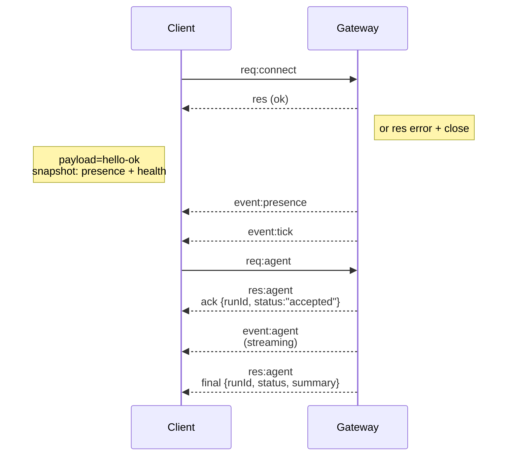

# Gateway architecture

Last updated: 2026-01-22

## Overview

- 하나의 long-lived **Gateway**가 모든 messaging surface를 소유합니다. (Baileys 기반 WhatsApp, grammY 기반 Telegram, Slack, Discord, Signal, iMessage, WebChat)
- control-plane client(macOS app, CLI, web UI, automation)는 configured bind host의 **WebSocket**으로 Gateway에 연결합니다. (기본값 `127.0.0.1:18789`)
- **Node**(macOS/iOS/Android/headless)도 **WebSocket**으로 연결하지만, 명시적 caps/commands와 함께 `role: node`를 선언합니다.
- host당 Gateway는 하나이며, 이 프로세스만 WhatsApp session을 엽니다.
- **canvas host**는 Gateway HTTP server 아래에서 제공됩니다.
  - `/__openclaw__/canvas/` (agent-editable HTML/CSS/JS)
  - `/__openclaw__/a2ui/` (A2UI host)
  같은 port(`18789` 기본값)를 사용합니다.

## Components and flows

### Gateway (daemon)

- provider connection을 유지합니다.
- typed WS API(request, response, server-push event)를 노출합니다.
- inbound frame을 JSON Schema로 validate합니다.
- `agent`, `chat`, `presence`, `health`, `heartbeat`, `cron` 같은 event를 emit합니다.

### Clients (mac app / CLI / web admin)

- client당 하나의 WS connection을 가집니다.
- `health`, `status`, `send`, `agent`, `system-presence` 같은 request를 보냅니다.
- `tick`, `agent`, `presence`, `shutdown` 같은 event를 subscribe합니다.

### Nodes (macOS / iOS / Android / headless)

- `role: node`로 **같은 WS server**에 연결합니다.
- `connect`에서 device identity를 제공합니다. pairing은 **device 기반**이며(role `node`), 승인은 device pairing store에 저장됩니다.
- `canvas.*`, `camera.*`, `screen.record`, `location.get` 같은 command를 노출합니다.

Protocol details:

- [Gateway protocol](/gateway/protocol)

### WebChat

- chat history와 send를 위해 Gateway WS API를 사용하는 static UI입니다.
- remote setup에서는 다른 client와 같은 SSH/Tailscale tunnel을 통해 연결됩니다.

## Connection lifecycle (single client)



## Wire protocol (summary)

- transport: WebSocket, JSON payload를 담은 text frame
- 첫 frame은 반드시 `connect`
- handshake 후:
  - request: `{type:"req", id, method, params}` → `{type:"res", id, ok, payload|error}`
  - event: `{type:"event", event, payload, seq?, stateVersion?}`
- `OPENCLAW_GATEWAY_TOKEN` (또는 `--token`)이 설정되어 있으면 `connect.params.auth.token`이 일치해야 하며, 아니면 socket이 닫힙니다.
- side-effecting method(`send`, `agent`)는 안전한 retry를 위해 idempotency key가 필요합니다. 서버는 짧은 dedupe cache를 유지합니다.
- node는 `connect`에 `role: "node"`와 caps/commands/permissions를 포함해야 합니다.

## Pairing + local trust

- 모든 WS client(operator + node)는 `connect`에 **device identity**를 포함합니다.
- 새로운 device ID는 pairing approval이 필요하며, Gateway는 이후 connect용 **device token**을 발급합니다.
- **Local** connect(loopback 또는 gateway host 자신의 tailnet 주소)는 same-host UX를 위해 auto-approve될 수 있습니다.
- 모든 connect는 `connect.challenge` nonce에 서명해야 합니다.
- signature payload `v3`는 `platform` + `deviceFamily`도 binding합니다. gateway는 reconnect 시 paired metadata를 고정하고, metadata가 바뀌면 repair pairing을 요구합니다.
- **Non-local** connect는 여전히 명시적 approval이 필요합니다.
- `gateway.auth.*`는 local이든 remote든 **모든** connection에 적용됩니다.

Details: [Gateway protocol](/gateway/protocol), [Pairing](/channels/pairing), [Security](/gateway/security)

## Protocol typing and codegen

- TypeBox schema가 protocol을 정의합니다.
- JSON Schema는 이 schema에서 생성됩니다.
- Swift model도 JSON Schema에서 생성됩니다.

## Remote access

- 권장: Tailscale 또는 VPN
- 대안: SSH tunnel

  ```bash
  ssh -N -L 18789:127.0.0.1:18789 user@host
  ```

- tunnel을 통해서도 같은 handshake + auth token이 적용됩니다.
- remote setup에서는 WS에 TLS와 optional pinning을 켤 수 있습니다.

## Operations snapshot

- 시작: `openclaw gateway` (foreground, stdout으로 log)
- health: WS의 `health` (또는 `hello-ok`에도 포함)
- supervision: auto-restart용 launchd/systemd

## Invariants

- host당 정확히 하나의 Gateway가 단일 Baileys session을 제어합니다.
- handshake는 필수이며, non-JSON이거나 `connect`가 아닌 첫 frame은 즉시 hard close됩니다.
- event는 replay되지 않으므로 gap이 있으면 client가 refresh해야 합니다.
