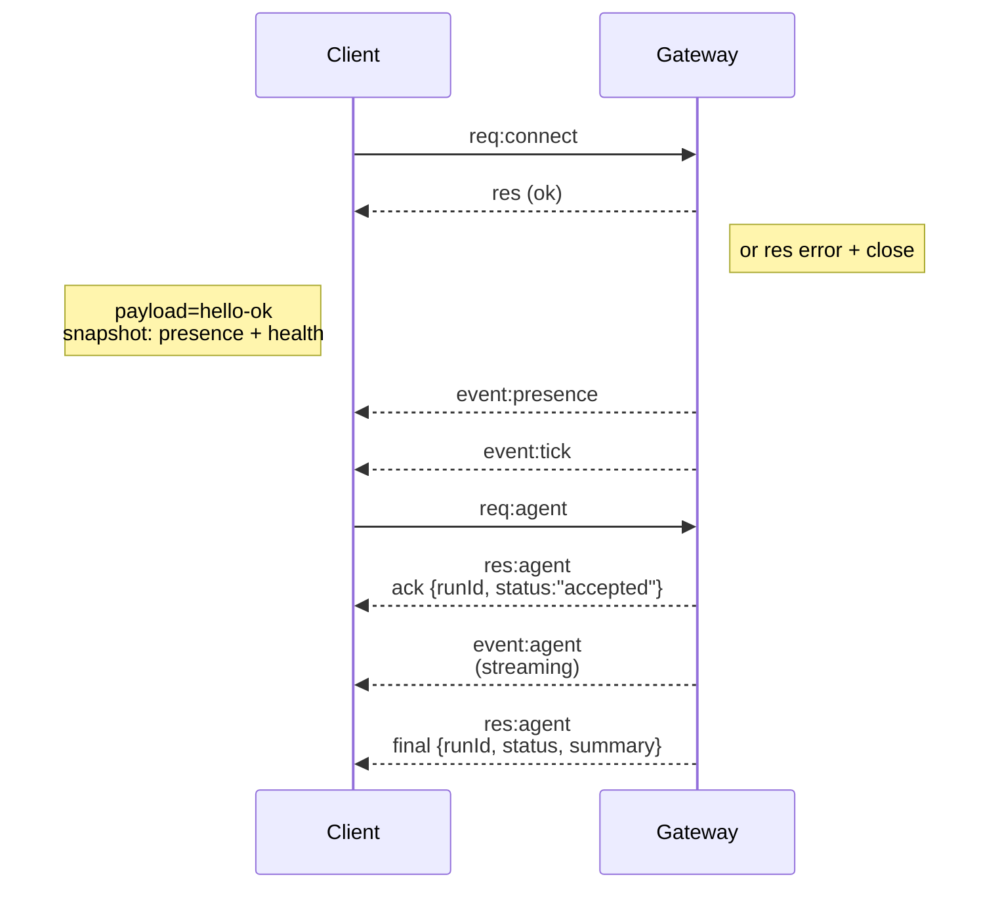

# 게이트웨이 아키텍처

최종 업데이트: 2026-01-22

## 개요

- 단일 장기 실행 **Gateway**가 모든 메시징 표면을 소유합니다(WhatsApp via
  Baileys, Telegram via grammY, Slack, Discord, Signal, iMessage, WebChat).
- 제어 평면 클라이언트(macOS 앱, CLI, 웹 UI, 자동화)는 설정된 바인드 호스트의 **WebSocket**을 통해 Gateway에 연결됩니다(기본값
  `127.0.0.1:18789`).
- **노드**(macOS/iOS/Android/headless)도 **WebSocket**으로 연결되지만,
  명시적인 caps/commands와 함께 `role: node`를 선언합니다.
- 호스트당 Gateway는 하나이며, WhatsApp 세션을 여는 유일한 구성요소입니다.
- **canvas host**는 Gateway HTTP 서버에서 다음 경로로 제공됩니다.
  - `/__openclaw__/canvas/` (에이전트가 편집 가능한 HTML/CSS/JS)
  - `/__openclaw__/a2ui/` (A2UI 호스트)
    Gateway와 같은 포트(기본 `18789`)를 사용합니다.

## 구성요소와 흐름

### Gateway(데몬)

- 프로바이더 연결을 유지합니다.
- 타입이 지정된 WS API(요청, 응답, 서버 푸시 이벤트)를 노출합니다.
- 들어오는 프레임을 JSON Schema로 검증합니다.
- `agent`, `chat`, `presence`, `health`, `heartbeat`, `cron` 같은 이벤트를 방출합니다.

### 클라이언트(mac 앱 / CLI / 웹 관리자)

- 클라이언트당 WS 연결 하나.
- 요청 전송(`health`, `status`, `send`, `agent`, `system-presence`).
- 이벤트 구독(`tick`, `agent`, `presence`, `shutdown`).

### 노드(macOS / iOS / Android / headless)

- `role: node`와 함께 **같은 WS 서버**에 연결합니다.
- `connect`에서 기기 정체성을 제공합니다. 페어링은 **기기 기반**(`role: node`)이며
  승인은 기기 페어링 저장소에 기록됩니다.
- `canvas.*`, `camera.*`, `screen.record`, `location.get` 같은 명령을 노출합니다.

프로토콜 세부사항:

- [게이트웨이 프로토콜](/gateway/protocol)

### WebChat

- 채팅 기록과 전송에 Gateway WS API를 사용하는 정적 UI입니다.
- 원격 구성에서는 다른 클라이언트와 같은 SSH/Tailscale 터널을 통해 연결합니다.

## 연결 수명주기(단일 클라이언트)



## 와이어 프로토콜(요약)

- 전송: WebSocket, JSON 페이로드를 담은 텍스트 프레임.
- 첫 번째 프레임은 반드시 `connect`여야 합니다.
- 핸드셰이크 후:
  - 요청: `{type:"req", id, method, params}` → `{type:"res", id, ok, payload|error}`
  - 이벤트: `{type:"event", event, payload, seq?, stateVersion?}`
- `OPENCLAW_GATEWAY_TOKEN`(또는 `--token`)이 설정되어 있으면 `connect.params.auth.token`이 일치해야 하며, 그렇지 않으면 소켓이 닫힙니다.
- 멱등성 키는 부작용이 있는 메서드(`send`, `agent`)에 필요하며 안전한 재시도를 위해 사용됩니다. 서버는 짧은 수명의 dedupe 캐시를 유지합니다.
- 노드는 `connect`에 `role: "node"`와 함께 caps/commands/permissions를 포함해야 합니다.

## 페어링 + 로컬 신뢰

- 모든 WS 클라이언트(운영자 + 노드)는 `connect`에 **기기 정체성**을 포함합니다.
- 새 기기 ID는 페어링 승인이 필요하며, Gateway는 이후 연결용 **기기 토큰**을 발급합니다.
- **로컬** 연결(loopback 또는 게이트웨이 호스트 자체 tailnet 주소)은
  같은 호스트 UX를 부드럽게 유지하기 위해 자동 승인될 수 있습니다.
- 모든 연결은 `connect.challenge` nonce에 서명해야 합니다.
- 서명 페이로드 `v3`는 `platform` + `deviceFamily`도 바인딩하며, 게이트웨이는
  재연결 시 페어링된 메타데이터를 고정하고 메타데이터 변경 시 수리 페어링을 요구합니다.
- **비로컬** 연결은 여전히 명시적 승인이 필요합니다.
- Gateway 인증(`gateway.auth.*`)은 로컬이든 원격이든 **모든** 연결에 계속 적용됩니다.

자세한 내용: [게이트웨이 프로토콜](/gateway/protocol), [페어링](/channels/pairing),
[보안](/gateway/security).

## 프로토콜 타이핑과 코드 생성

- TypeBox 스키마가 프로토콜을 정의합니다.
- JSON Schema는 이 스키마로부터 생성됩니다.
- Swift 모델은 JSON Schema로부터 생성됩니다.

## 원격 액세스

- 권장: Tailscale 또는 VPN.
- 대안: SSH 터널

  ```bash
  ssh -N -L 18789:127.0.0.1:18789 user@host
  ```

- 같은 핸드셰이크 + 인증 토큰이 터널 위에서도 적용됩니다.
- 원격 구성에서는 WS용 TLS + 선택적 pinning을 활성화할 수 있습니다.

## 운영 스냅샷

- 시작: `openclaw gateway`(포그라운드, 로그는 stdout).
- 상태 확인: WS를 통한 `health`(`hello-ok`에도 포함).
- 감독: 자동 재시작용 launchd/systemd.

## 불변 조건

- 호스트당 정확히 하나의 Gateway만 단일 Baileys 세션을 제어합니다.
- 핸드셰이크는 필수이며, JSON이 아니거나 첫 프레임이 connect가 아니면 즉시 연결을 닫습니다.
- 이벤트는 재생되지 않으므로, 누락이 있으면 클라이언트가 새로고침해야 합니다.
