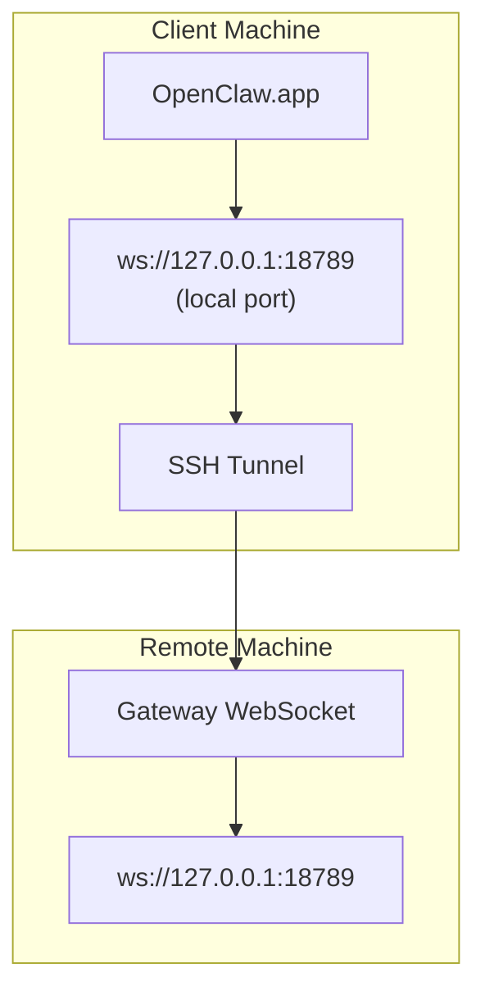

# Running OpenClaw.app with a Remote Gateway

OpenClaw.app은 SSH tunneling을 사용해 remote gateway에 연결합니다. 이 가이드는 그 설정 방법을 설명합니다.

## Overview



## Quick Setup

### Step 1: Add SSH Config

`~/.ssh/config`를 열고 다음을 추가합니다.

```ssh
Host remote-gateway
    HostName <REMOTE_IP>          # 예: 172.27.187.184
    User <REMOTE_USER>            # 예: jefferson
    LocalForward 18789 127.0.0.1:18789
    IdentityFile ~/.ssh/id_rsa
```

`<REMOTE_IP>`와 `<REMOTE_USER>`를 실제 값으로 바꾸세요.

### Step 2: Copy SSH Key

공개 키를 remote machine으로 복사합니다. 비밀번호는 한 번만 입력하면 됩니다.

```bash
ssh-copy-id -i ~/.ssh/id_rsa <REMOTE_USER>@<REMOTE_IP>
```

### Step 3: Set Gateway Token

```bash
launchctl setenv OPENCLAW_GATEWAY_TOKEN "<your-token>"
```

### Step 4: Start SSH Tunnel

```bash
ssh -N remote-gateway &
```

### Step 5: Restart OpenClaw.app

```bash
# OpenClaw.app 종료(⌘Q) 후 다시 열기:
open /path/to/OpenClaw.app
```

이제 앱은 SSH tunnel을 통해 remote gateway에 연결됩니다.

---

## Auto-Start Tunnel on Login

로그인 시 SSH tunnel을 자동 시작하려면 Launch Agent를 만드세요.

### Create the PLIST file

다음을 `~/Library/LaunchAgents/ai.openclaw.ssh-tunnel.plist`로 저장합니다.

```xml
<?xml version="1.0" encoding="UTF-8"?>
<!DOCTYPE plist PUBLIC "-//Apple//DTD PLIST 1.0//EN" "http://www.apple.com/DTDs/PropertyList-1.0.dtd">
<plist version="1.0">
<dict>
    <key>Label</key>
    <string>ai.openclaw.ssh-tunnel</string>
    <key>ProgramArguments</key>
    <array>
        <string>/usr/bin/ssh</string>
        <string>-N</string>
        <string>remote-gateway</string>
    </array>
    <key>KeepAlive</key>
    <true/>
    <key>RunAtLoad</key>
    <true/>
</dict>
</plist>
```

### Load the Launch Agent

```bash
launchctl bootstrap gui/$UID ~/Library/LaunchAgents/ai.openclaw.ssh-tunnel.plist
```

이제 tunnel은 다음처럼 동작합니다.

- 로그인 시 자동 시작
- 크래시 시 자동 재시작
- 백그라운드에서 계속 실행

레거시 참고: `com.openclaw.ssh-tunnel` LaunchAgent가 남아 있다면 제거하세요.

---

## Troubleshooting

**Check if tunnel is running:**

```bash
ps aux | grep "ssh -N remote-gateway" | grep -v grep
lsof -i :18789
```

**Restart the tunnel:**

```bash
launchctl kickstart -k gui/$UID/ai.openclaw.ssh-tunnel
```

**Stop the tunnel:**

```bash
launchctl bootout gui/$UID/ai.openclaw.ssh-tunnel
```

---

## How It Works

| Component                            | What It Does                                       |
| ------------------------------------ | -------------------------------------------------- |
| `LocalForward 18789 127.0.0.1:18789` | 로컬 포트 18789를 remote 포트 18789로 전달         |
| `ssh -N`                             | remote 명령 실행 없이 SSH만 수행(포트 포워딩 전용) |
| `KeepAlive`                          | 크래시 시 tunnel 자동 재시작                       |
| `RunAtLoad`                          | agent 로드 시 tunnel 시작                          |

OpenClaw.app은 client machine의 `ws://127.0.0.1:18789`에 연결합니다. SSH tunnel이 이 연결을 remote machine의 포트 18789로 전달하며, 거기에서 Gateway가 실행됩니다.
