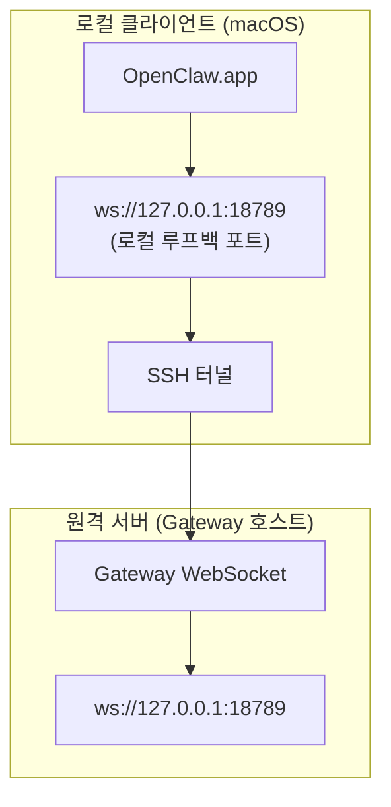

# 원격 Gateway와 OpenClaw.app 연결

OpenClaw.app은 SSH 터널링을 사용해 원격 Gateway에 연결합니다. 이 문서는 필요한 설정 절차를 단계별로 설명합니다.

## 연결 구조 개요



## 빠른 설정 단계

### 1단계: SSH 설정 추가

`~/.ssh/config` 파일을 열어 다음 내용을 추가함:

```ssh
Host remote-gateway
    HostName <REMOTE_IP>          # 예: 172.27.187.184
    User <REMOTE_USER>            # 예: jefferson
    LocalForward 18789 127.0.0.1:18789
    IdentityFile ~/.ssh/id_rsa
```

`<REMOTE_IP>`와 `<REMOTE_USER>` 부분을 실제 원격 서버 정보로 수정함.

### 2단계: SSH 키 복사

로컬의 공개 키를 원격 서버로 복사함 (최초 1회 비밀번호 입력 필요):

```bash
ssh-copy-id -i ~/.ssh/id_rsa <REMOTE_USER>@<REMOTE_IP>
```

### 3단계: Gateway 토큰 설정

앱이 인증을 통과할 수 있도록 토큰 정보를 환경 변수에 등록함:

```bash
launchctl setenv OPENCLAW_GATEWAY_TOKEN "<사용자-토큰>"
```

### 4단계: SSH 터널 시작

터미널에서 백그라운드로 터널을 실행함:

```bash
ssh -N remote-gateway &
```

### 5단계: OpenClaw.app 재시작

```bash
# 실행 중인 OpenClaw.app 종료(⌘Q) 후 다시 실행함:
open /Applications/OpenClaw.app
```

이제 앱은 로컬 포트를 통해 원격 Gateway 서버에 정상적으로 연결됨.

---

## 로그인 시 터널 자동 시작 설정 (Launch Agent)

매번 수동으로 터널을 켤 필요 없이, macOS 로그인 시 자동으로 실행되도록 설정할 수 있음.

### PLIST 파일 생성

`~/Library/LaunchAgents/ai.openclaw.ssh-tunnel.plist` 경로에 다음 내용을 저장함:

```xml
<?xml version="1.0" encoding="UTF-8"?>
<!DOCTYPE plist PUBLIC "-//Apple//DTD PLIST 1.0//EN" "http://www.apple.com/DTDs/PropertyList-1.0.dtd">
<plist version="1.0">
<dict>
    <key>Label</key>
    <string>ai.openclaw.ssh-tunnel</string>
    <key>ProgramArguments</key>
    <array>
        <string>/usr/bin/ssh</string>
        <string>-N</string>
        <string>remote-gateway</string>
    </array>
    <key>KeepAlive</key>
    <true/>
    <key>RunAtLoad</key>
    <true/>
</dict>
</plist>
```

### Launch Agent 등록 및 로드

```bash
launchctl bootstrap gui/$UID ~/Library/LaunchAgents/ai.openclaw.ssh-tunnel.plist
```

이 설정을 마치면 SSH 터널이 다음과 같이 관리됨:
- macOS 로그인 시 자동으로 시작됨.
- 프로세스 종료(크래시) 시 자동으로 재시작됨.
- 백그라운드에서 상시 대기 상태를 유지함.

*참고: 이전에 사용하던 `com.openclaw.ssh-tunnel` 설정이 남아 있다면 충돌 방지를 위해 제거하기 바람.*

---

## 문제 해결 (Troubleshooting)

**터널 실행 여부 확인:**

```bash
ps aux | grep "ssh -N remote-gateway" | grep -v grep
lsof -i :18789
```

**터널 강제 재시작:**

```bash
launchctl kickstart -k gui/$UID/ai.openclaw.ssh-tunnel
```

**터널 서비스 중지:**

```bash
launchctl bootout gui/$UID/ai.openclaw.ssh-tunnel
```

---

## 동작 원리 상세

| 컴포넌트 | 역할 및 기능 |
| :--- | :--- |
| **`LocalForward 18789 127.0.0.1:18789`** | 로컬의 18789 포트로 들어오는 트래픽을 원격 서버의 18789 포트로 전달함. |
| **`ssh -N`** | 원격 명령 실행 없이 포트 포워딩 기능만 수행함. |
| **`KeepAlive`** | 터널 연결이 끊어질 경우 자동으로 복구를 시도함. |
| **`RunAtLoad`** | 시스템 에이전트가 로드되는 시점(로그인 시)에 터널을 활성화함. |

OpenClaw 앱은 클라이언트 기기의 `ws://127.0.0.1:18789` 주소로 접속을 시도하며, SSH 터널은 이 요청을 가로채어 실제 Gateway가 실행 중인 원격 서버의 포트로 안전하게 전달함.
