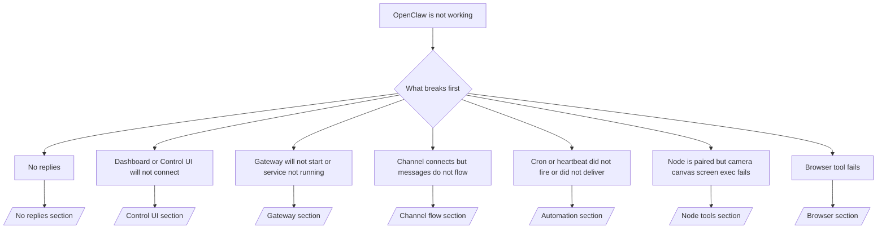

# 문제 해결

2분밖에 없다면 이 페이지를 트리아지 시작점으로 사용하세요.

## 처음 60초

아래 순서대로 정확히 실행하세요.

```bash
openclaw status
openclaw status --all
openclaw gateway probe
openclaw gateway status
openclaw doctor
openclaw channels status --probe
openclaw logs --follow
```

한 줄 요약으로 좋은 출력은 다음과 같습니다.

- `openclaw status` → 구성된 채널이 보이고 뚜렷한 인증 오류가 없습니다.
- `openclaw status --all` → 전체 리포트가 생성되고 공유 가능한 상태입니다.
- `openclaw gateway probe` → 기대하는 gateway 대상에 도달할 수 있습니다.
- `openclaw gateway status` → `Runtime: running` 및 `RPC probe: ok`가 나옵니다.
- `openclaw doctor` → config 또는 서비스 차원의 치명적인 오류가 없습니다.
- `openclaw channels status --probe` → 채널이 `connected` 또는 `ready`로 보고됩니다.
- `openclaw logs --follow` → 활동이 계속 보이고 반복되는 치명적 오류가 없습니다.

## Anthropic 장문 컨텍스트 429

다음 오류가 보이면:
`HTTP 429: rate_limit_error: Extra usage is required for long context requests`
[/gateway/troubleshooting#anthropic-429-extra-usage-required-for-long-context](/gateway/troubleshooting#anthropic-429-extra-usage-required-for-long-context)로 이동하세요.

## 플러그인 설치 실패: missing openclaw extensions

설치가 `package.json missing openclaw.extensions` 오류로 실패한다면, 해당 플러그인 패키지가 OpenClaw가 더 이상 허용하지 않는 예전 형태를 사용하고 있다는 뜻입니다.

플러그인 패키지에서 다음을 수정하세요.

1. `package.json`에 `openclaw.extensions`를 추가합니다.
2. 항목이 빌드된 런타임 파일을 가리키도록 합니다. 보통 `./dist/index.js`
3. 플러그인을 다시 배포하고 `openclaw plugins install <npm-spec>`를 다시 실행합니다.

예시:

```json
{
  "name": "@openclaw/my-plugin",
  "version": "1.2.3",
  "openclaw": {
    "extensions": ["./dist/index.js"]
  }
}
```

참고: [/tools/plugin#distribution-npm](/tools/plugin#distribution-npm)

## 결정 트리



<AccordionGroup>
  <Accordion title="No replies">
    ```bash
    openclaw status
    openclaw gateway status
    openclaw channels status --probe
    openclaw pairing list --channel <channel> [--account <id>]
    openclaw logs --follow
    ```

    좋은 출력 예:

    - `Runtime: running`
    - `RPC probe: ok`
    - `channels status --probe`에서 해당 채널이 connected/ready로 보임
    - 발신자가 승인되어 있거나 DM 정책이 open/allowlist 상태

    자주 보이는 로그 시그니처:

    - `drop guild message (mention required` → Discord에서 mention gating 때문에 메시지 처리가 막혔습니다.
    - `pairing request` → 발신자가 승인되지 않아 DM pairing 승인을 기다리는 중입니다.
    - 채널 로그의 `blocked` / `allowlist` → 발신자, 방, 그룹이 필터링되고 있습니다.

    자세한 문서:

    - [/gateway/troubleshooting#no-replies](/gateway/troubleshooting#no-replies)
    - [/channels/troubleshooting](/channels/troubleshooting)
    - [/channels/pairing](/channels/pairing)

  </Accordion>

  <Accordion title="Dashboard or Control UI will not connect">
    ```bash
    openclaw status
    openclaw gateway status
    openclaw logs --follow
    openclaw doctor
    openclaw channels status --probe
    ```

    좋은 출력 예:

    - `openclaw gateway status`에 `Dashboard: http://...`가 표시됨
    - `RPC probe: ok`
    - 로그에 인증 루프가 없음

    자주 보이는 로그 시그니처:

    - `device identity required` → HTTP 또는 비보안 컨텍스트에서는 device auth를 완료할 수 없습니다.
    - `unauthorized` / 재연결 루프 → token/password가 잘못되었거나 auth mode가 맞지 않습니다.
    - `gateway connect failed:` → UI가 잘못된 URL/포트의 gateway를 가리키거나 도달할 수 없습니다.

    자세한 문서:

    - [/gateway/troubleshooting#dashboard-control-ui-connectivity](/gateway/troubleshooting#dashboard-control-ui-connectivity)
    - [/web/control-ui](/web/control-ui)
    - [/gateway/authentication](/gateway/authentication)

  </Accordion>

  <Accordion title="Gateway will not start or service installed but not running">
    ```bash
    openclaw status
    openclaw gateway status
    openclaw logs --follow
    openclaw doctor
    openclaw channels status --probe
    ```

    좋은 출력 예:

    - `Service: ... (loaded)`
    - `Runtime: running`
    - `RPC probe: ok`

    자주 보이는 로그 시그니처:

    - `Gateway start blocked: set gateway.mode=local` → gateway mode가 비어 있거나 remote로 되어 있습니다.
    - `refusing to bind gateway ... without auth` → 비-loopback bind에 token/password가 없습니다.
    - `another gateway instance is already listening` 또는 `EADDRINUSE` → 포트를 다른 프로세스가 사용 중입니다.

    자세한 문서:

    - [/gateway/troubleshooting#gateway-service-not-running](/gateway/troubleshooting#gateway-service-not-running)
    - [/gateway/background-process](/gateway/background-process)
    - [/gateway/configuration](/gateway/configuration)

  </Accordion>

  <Accordion title="Channel connects but messages do not flow">
    ```bash
    openclaw status
    openclaw gateway status
    openclaw logs --follow
    openclaw doctor
    openclaw channels status --probe
    ```

    좋은 출력 예:

    - 채널 전송 계층이 연결되어 있습니다.
    - pairing/allowlist 검사를 통과합니다.
    - 필요한 곳에서 mention이 감지됩니다.

    자주 보이는 로그 시그니처:

    - `mention required` → 그룹 mention gating 때문에 처리가 차단되었습니다.
    - `pairing` / `pending` → DM 발신자가 아직 승인되지 않았습니다.
    - `not_in_channel`, `missing_scope`, `Forbidden`, `401/403` → 채널 권한 또는 token 문제입니다.

    자세한 문서:

    - [/gateway/troubleshooting#channel-connected-messages-not-flowing](/gateway/troubleshooting#channel-connected-messages-not-flowing)
    - [/channels/troubleshooting](/channels/troubleshooting)

  </Accordion>

  <Accordion title="Cron or heartbeat did not fire or did not deliver">
    ```bash
    openclaw status
    openclaw gateway status
    openclaw cron status
    openclaw cron list
    openclaw cron runs --id <jobId> --limit 20
    openclaw logs --follow
    ```

    좋은 출력 예:

    - `cron.status`가 enabled 상태이며 다음 wake 시간이 표시됨
    - `cron runs`에 최근 `ok` 항목이 있음
    - heartbeat가 활성화되어 있고 active hours 밖이 아님

    자주 보이는 로그 시그니처:

    - `cron: scheduler disabled; jobs will not run automatically` → cron이 비활성화되어 있습니다.
    - `heartbeat skipped`와 함께 `reason=quiet-hours` → 설정된 active hours 밖입니다.
    - `requests-in-flight` → 메인 레인이 바빠서 heartbeat wake가 지연되었습니다.
    - `unknown accountId` → heartbeat 전달 대상 account가 존재하지 않습니다.

    자세한 문서:

    - [/gateway/troubleshooting#cron-and-heartbeat-delivery](/gateway/troubleshooting#cron-and-heartbeat-delivery)
    - [/automation/troubleshooting](/automation/troubleshooting)
    - [/gateway/heartbeat](/gateway/heartbeat)

  </Accordion>

  <Accordion title="Node is paired but tool fails camera canvas screen exec">
    ```bash
    openclaw status
    openclaw gateway status
    openclaw nodes status
    openclaw nodes describe --node <idOrNameOrIp>
    openclaw logs --follow
    ```

    좋은 출력 예:

    - node가 role `node`로 연결 및 paired 상태로 표시됩니다.
    - 호출한 명령에 필요한 capability가 존재합니다.
    - 도구에 필요한 permission 상태가 허용되어 있습니다.

    자주 보이는 로그 시그니처:

    - `NODE_BACKGROUND_UNAVAILABLE` → node 앱을 포그라운드로 가져오세요.
    - `*_PERMISSION_REQUIRED` → OS permission이 거부되었거나 빠져 있습니다.
    - `SYSTEM_RUN_DENIED: approval required` → exec 승인이 아직 대기 중입니다.
    - `SYSTEM_RUN_DENIED: allowlist miss` → 명령이 exec allowlist에 없습니다.

    자세한 문서:

    - [/gateway/troubleshooting#node-paired-tool-fails](/gateway/troubleshooting#node-paired-tool-fails)
    - [/nodes/troubleshooting](/nodes/troubleshooting)
    - [/tools/exec-approvals](/tools/exec-approvals)

  </Accordion>

  <Accordion title="Browser tool fails">
    ```bash
    openclaw status
    openclaw gateway status
    openclaw browser status
    openclaw logs --follow
    openclaw doctor
    ```

    좋은 출력 예:

    - browser status에 `running: true`와 선택된 browser/profile이 표시됩니다.
    - `openclaw` profile이 시작되거나 `chrome` relay에 탭이 연결되어 있습니다.

    자주 보이는 로그 시그니처:

    - `Failed to start Chrome CDP on port` → 로컬 browser 실행에 실패했습니다.
    - `browser.executablePath not found` → 설정된 바이너리 경로가 잘못되었습니다.
    - `Chrome extension relay is running, but no tab is connected` → extension이 붙지 않았습니다.
    - `Browser attachOnly is enabled ... not reachable` → attach-only profile에 연결 가능한 CDP 대상이 없습니다.

    자세한 문서:

    - [/gateway/troubleshooting#browser-tool-fails](/gateway/troubleshooting#browser-tool-fails)
    - [/tools/browser-linux-troubleshooting](/tools/browser-linux-troubleshooting)
    - [/tools/browser-wsl2-windows-remote-cdp-troubleshooting](/tools/browser-wsl2-windows-remote-cdp-troubleshooting)
    - [/tools/chrome-extension](/tools/chrome-extension)

  </Accordion>
</AccordionGroup>
