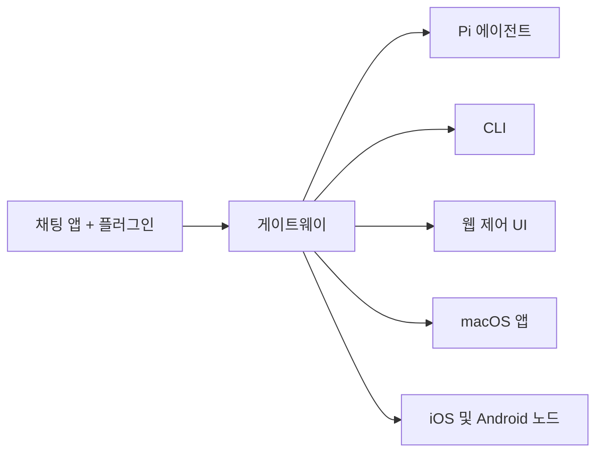

# OpenClaw 🦞

<p align="center">
    
    
</p>

> _"EXFOLIATE! EXFOLIATE!"_ — 우주 바닷가재, 아마도

<p align="center">
  <strong>WhatsApp, Telegram, Discord, iMessage 등을 통해 AI 에이전트에 접근할 수 있는 모든 OS용 게이트웨이.</strong><br />
  메시지를 보내면 주머니에서 에이전트 응답을 받습니다. 플러그인으로 Mattermost 등을 추가할 수 있습니다.
</p>

<Columns>
  <Card title="시작하기" href="/start/getting-started" icon="rocket">
    OpenClaw를 설치하고 몇 분 안에 게이트웨이를 실행하세요.
  </Card>
  <Card title="마법사 실행" href="/start/wizard" icon="sparkles">
    `openclaw onboard` 및 페어링 플로우로 안내되는 설정.
  </Card>
  <Card title="제어 UI 열기" href="/web/control-ui" icon="layout-dashboard">
    채팅, 설정 및 세션을 위한 브라우저 대시보드를 실행하세요.
  </Card>
</Columns>

## OpenClaw란 무엇인가요?

OpenClaw는 WhatsApp, Telegram, Discord, iMessage 등 즐겨 사용하는 채팅 앱을 Pi와 같은 AI 코딩 에이전트에 연결하는 **자체 호스팅 게이트웨이**입니다. 자신의 머신(또는 서버)에서 단일 게이트웨이 프로세스를 실행하면 메시징 앱과 항상 사용 가능한 AI 어시스턴트 사이의 브리지가 됩니다.

**누구를 위한 것인가요?** 데이터 제어권을 포기하거나 호스팅 서비스에 의존하지 않고 어디서나 메시지를 보낼 수 있는 개인 AI 어시스턴트를 원하는 개발자 및 파워 유저.

**무엇이 다른가요?**

- **자체 호스팅**: 자신의 하드웨어에서 실행, 자신의 규칙
- **멀티 채널**: 하나의 게이트웨이가 WhatsApp, Telegram, Discord 등을 동시에 제공
- **에이전트 네이티브**: 도구 사용, 세션, 메모리 및 멀티 에이전트 라우팅을 갖춘 코딩 에이전트용으로 구축
- **오픈 소스**: MIT 라이선스, 커뮤니티 주도

**무엇이 필요한가요?** Node 22+, 선택한 제공업체의 API 키, 그리고 5분. 최상의 품질과 보안을 위해 사용 가능한 최신 세대의 가장 강력한 모델을 사용하세요.

## 작동 방식



게이트웨이는 세션, 라우팅 및 채널 연결에 대한 단일 진실 공급원입니다.

## 주요 기능

<Columns>
  <Card title="멀티 채널 게이트웨이" icon="network">
    단일 게이트웨이 프로세스로 WhatsApp, Telegram, Discord 및 iMessage.
  </Card>
  <Card title="플러그인 채널" icon="plug">
    확장 패키지로 Mattermost 등을 추가하세요.
  </Card>
  <Card title="멀티 에이전트 라우팅" icon="route">
    에이전트, 워크스페이스 또는 발신자별로 격리된 세션.
  </Card>
  <Card title="미디어 지원" icon="image">
    이미지, 오디오 및 문서를 보내고 받습니다.
  </Card>
  <Card title="웹 제어 UI" icon="monitor">
    채팅, 설정, 세션 및 노드를 위한 브라우저 대시보드.
  </Card>
  <Card title="모바일 노드" icon="smartphone">
    Canvas, 카메라 및 음성 지원 워크플로우를 위한 iOS 및 Android 노드 페어링.
  </Card>
</Columns>

## 빠른 시작

<Steps>
  <Step title="OpenClaw 설치">
    ```bash
    npm install -g openclaw@latest
    ```
  </Step>
  <Step title="온보딩 및 서비스 설치">
    ```bash
    openclaw onboard --install-daemon
    ```
  </Step>
  <Step title="WhatsApp 페어링 및 게이트웨이 시작">
    ```bash
    openclaw channels login
    openclaw gateway --port 18789
    ```
  </Step>
</Steps>

전체 설치 및 개발 설정이 필요하신가요? [빠른 시작](/start/quickstart)을 참조하세요.

## 대시보드

게이트웨이가 시작된 후 브라우저 제어 UI를 여세요.

- 로컬 기본값: [http://127.0.0.1:18789/](http://127.0.0.1:18789/)
- 원격 액세스: [웹 서피스](/web) 및 [Tailscale](/gateway/tailscale)

<p align="center">
  
</p>

## 구성 (선택 사항)

구성은 `~/.openclaw/openclaw.json`에 있습니다.

- **아무것도 하지 않으면** OpenClaw는 발신자별 세션이 있는 RPC 모드에서 번들된 Pi 바이너리를 사용합니다.
- 잠그려면 `channels.whatsapp.allowFrom`과 (그룹의 경우) 멘션 규칙으로 시작하세요.

예시:

```json5
{
  channels: {
    whatsapp: {
      allowFrom: ["+15555550123"],
      groups: { "*": { requireMention: true } },
    },
  },
  messages: { groupChat: { mentionPatterns: ["@openclaw"] } },
}
```

## 여기서 시작하세요

<Columns>
  <Card title="문서 허브" href="/start/hubs" icon="book-open">
    사용 사례별로 정리된 모든 문서 및 가이드.
  </Card>
  <Card title="구성" href="/gateway/configuration" icon="settings">
    핵심 게이트웨이 설정, 토큰 및 제공업체 구성.
  </Card>
  <Card title="원격 액세스" href="/gateway/remote" icon="globe">
    SSH 및 tailnet 액세스 패턴.
  </Card>
  <Card title="채널" href="/channels/telegram" icon="message-square">
    WhatsApp, Telegram, Discord 등을 위한 채널별 설정.
  </Card>
  <Card title="노드" href="/nodes" icon="smartphone">
    페어링, Canvas, 카메라 및 장치 작업이 있는 iOS 및 Android 노드.
  </Card>
  <Card title="도움말" href="/help" icon="life-buoy">
    일반적인 수정 사항 및 문제 해결 진입점.
  </Card>
</Columns>

## 자세히 알아보기

<Columns>
  <Card title="전체 기능 목록" href="/concepts/features" icon="list">
    완전한 채널, 라우팅 및 미디어 기능.
  </Card>
  <Card title="멀티 에이전트 라우팅" href="/concepts/multi-agent" icon="route">
    워크스페이스 격리 및 에이전트별 세션.
  </Card>
  <Card title="보안" href="/gateway/security" icon="shield">
    토큰, 허용 목록 및 안전 제어.
  </Card>
  <Card title="문제 해결" href="/gateway/troubleshooting" icon="wrench">
    게이트웨이 진단 및 일반적인 오류.
  </Card>
  <Card title="정보 및 크레딧" href="/reference/credits" icon="info">
    프로젝트 기원, 기여자 및 라이선스.
  </Card>
</Columns>
