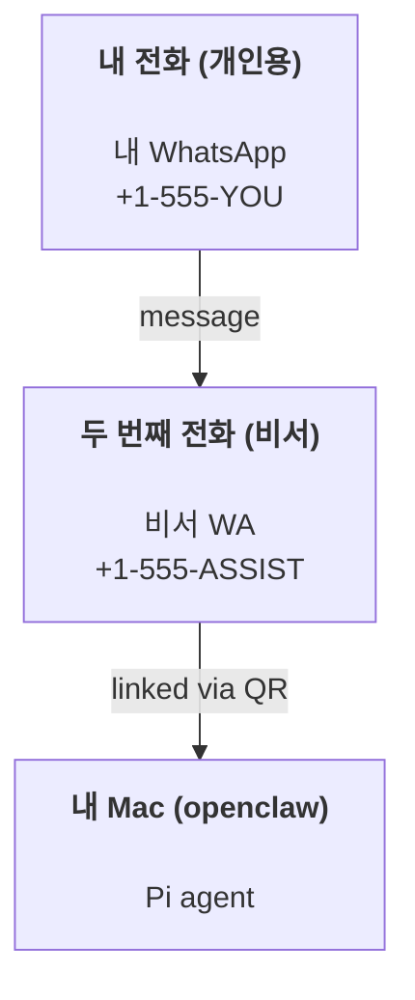

# OpenClaw로 개인 비서 구축하기

OpenClaw는 **Pi** 에이전트를 위한 WhatsApp + Telegram + Discord + iMessage 게이트웨이입니다. 플러그인으로 Mattermost를 추가할 수 있습니다. 이 가이드는 "개인 비서" 설정입니다: 항상 켜져 있는 에이전트처럼 동작하는 전용 WhatsApp 번호 하나를 사용합니다.

## ⚠️ 안전 우선

에이전트를 다음과 같은 위치에 배치하게 됩니다:

- 머신에서 명령 실행 (Pi 도구 설정에 따라)
- 작업 공간에서 파일 읽기/쓰기
- WhatsApp/Telegram/Discord/Mattermost(플러그인)를 통해 메시지 다시 보내기

보수적으로 시작하세요:

- 항상 `channels.whatsapp.allowFrom`을 설정하세요 (개인 Mac에서 전 세계에 열린 상태로 실행하지 마세요).
- 비서용 전용 WhatsApp 번호를 사용하세요.
- 하트비트는 이제 기본적으로 30분마다 실행됩니다. 설정을 신뢰할 때까지 `agents.defaults.heartbeat.every: "0m"`로 설정하여 비활성화하세요.

## 사전 요구사항

- OpenClaw 설치 및 온보딩 완료 — 아직 완료하지 않았다면 [시작하기](/start/getting-started)를 참조하세요
- 비서용 두 번째 전화번호 (SIM/eSIM/선불)

## 두 개의 전화 설정 (권장)

다음과 같은 구성을 원합니다:



개인 WhatsApp을 OpenClaw에 연결하면 모든 메시지가 "에이전트 입력"이 됩니다. 이는 원하는 경우가 거의 없습니다.

## 5분 빠른 시작

1. WhatsApp Web 페어링 (QR 표시; 비서 전화로 스캔):

```bash
openclaw channels login
```

2. 게이트웨이 시작 (실행 상태 유지):

```bash
openclaw gateway --port 18789
```

3. `~/.openclaw/openclaw.json`에 최소 설정 입력:

```json5
{
  channels: { whatsapp: { allowFrom: ["+15555550123"] } },
}
```

이제 허용 목록에 있는 전화에서 비서 번호로 메시지를 보내세요.

온보딩이 완료되면 대시보드가 자동으로 열리고 깔끔한 (토큰화되지 않은) 링크가 출력됩니다. 인증을 요청하면 `gateway.auth.token`의 토큰을 Control UI 설정에 붙여넣으세요. 나중에 다시 열려면: `openclaw dashboard`.

## 에이전트에 작업 공간 제공 (AGENTS)

OpenClaw는 작업 공간 디렉토리에서 운영 지침과 "메모리"를 읽습니다.

기본적으로 OpenClaw는 `~/.openclaw/workspace`를 에이전트 작업 공간으로 사용하며, 설정/첫 에이전트 실행 시 자동으로 생성합니다 (시작용 `AGENTS.md`, `SOUL.md`, `TOOLS.md`, `IDENTITY.md`, `USER.md`, `HEARTBEAT.md` 포함). `BOOTSTRAP.md`는 작업 공간이 완전히 새로운 경우에만 생성됩니다 (삭제 후 다시 생성되지 않아야 합니다). `MEMORY.md`는 선택 사항입니다 (자동 생성되지 않음); 존재하는 경우 일반 세션에 로드됩니다. 서브에이전트 세션은 `AGENTS.md`와 `TOOLS.md`만 주입합니다.

팁: 이 폴더를 OpenClaw의 "메모리"처럼 취급하고 git 저장소로 만드세요 (가급적 비공개). 그러면 `AGENTS.md` + 메모리 파일이 백업됩니다. git이 설치되어 있으면 완전히 새로운 작업 공간이 자동으로 초기화됩니다.

```bash
openclaw setup
```

전체 작업 공간 레이아웃 + 백업 가이드: [에이전트 작업 공간](/concepts/agent-workspace)
메모리 워크플로우: [메모리](/concepts/memory)

선택 사항: `agents.defaults.workspace`로 다른 작업 공간 선택 (`~` 지원).

```json5
{
  agent: {
    workspace: "~/.openclaw/workspace",
  },
}
```

저장소에서 자체 작업 공간 파일을 이미 제공하는 경우 부트스트랩 파일 생성을 완전히 비활성화할 수 있습니다:

```json5
{
  agent: {
    skipBootstrap: true,
  },
}
```

## "비서"로 만드는 설정

OpenClaw는 기본적으로 좋은 비서 설정을 제공하지만 일반적으로 다음을 조정하고 싶을 것입니다:

- `SOUL.md`의 페르소나/지침
- 사고 기본값 (원하는 경우)
- 하트비트 (신뢰한 후)

예시:

```json5
{
  logging: { level: "info" },
  agent: {
    model: "anthropic/claude-opus-4-6",
    workspace: "~/.openclaw/workspace",
    thinkingDefault: "high",
    timeoutSeconds: 1800,
    // 0으로 시작; 나중에 활성화.
    heartbeat: { every: "0m" },
  },
  channels: {
    whatsapp: {
      allowFrom: ["+15555550123"],
      groups: {
        "*": { requireMention: true },
      },
    },
  },
  routing: {
    groupChat: {
      mentionPatterns: ["@openclaw", "openclaw"],
    },
  },
  session: {
    scope: "per-sender",
    resetTriggers: ["/new", "/reset"],
    reset: {
      mode: "daily",
      atHour: 4,
      idleMinutes: 10080,
    },
  },
}
```

## 세션과 메모리

- 세션 파일: `~/.openclaw/agents/<agentId>/sessions/{{SessionId}}.jsonl`
- 세션 메타데이터 (토큰 사용량, 마지막 라우트 등): `~/.openclaw/agents/<agentId>/sessions/sessions.json` (레거시: `~/.openclaw/sessions/sessions.json`)
- `/new` 또는 `/reset`은 해당 채팅에 대한 새 세션을 시작합니다 (`resetTriggers`를 통해 구성 가능). 단독으로 전송되면 에이전트가 재설정을 확인하는 짧은 인사말로 응답합니다.
- `/compact [instructions]`는 세션 컨텍스트를 압축하고 남은 컨텍스트 예산을 보고합니다.

## 하트비트 (능동 모드)

기본적으로 OpenClaw는 다음 프롬프트로 30분마다 하트비트를 실행합니다:
`HEARTBEAT.md가 존재하면 읽으세요 (작업 공간 컨텍스트). 엄격히 따르세요. 이전 채팅에서 오래된 작업을 추론하거나 반복하지 마세요. 주의가 필요한 것이 없으면 HEARTBEAT_OK로 응답하세요.`
비활성화하려면 `agents.defaults.heartbeat.every: "0m"`로 설정하세요.

- `HEARTBEAT.md`가 존재하지만 실질적으로 비어 있는 경우 (빈 줄과 `# Heading`과 같은 마크다운 헤더만 있음), OpenClaw는 API 호출을 절약하기 위해 하트비트 실행을 건너뜁니다.
- 파일이 없으면 하트비트가 여전히 실행되고 모델이 무엇을 할지 결정합니다.
- 에이전트가 `HEARTBEAT_OK`로 응답하면 (선택적으로 짧은 패딩 포함; `agents.defaults.heartbeat.ackMaxChars` 참조), OpenClaw는 해당 하트비트에 대한 아웃바운드 전달을 억제합니다.
- 기본적으로 DM 스타일 `user:<id>` 대상에 대한 하트비트 전달이 허용됩니다. 하트비트 실행을 활성 상태로 유지하면서 직접 대상 전달을 억제하려면 `agents.defaults.heartbeat.directPolicy: "block"`으로 설정하세요.
- 하트비트는 전체 에이전트 턴을 실행합니다 — 짧은 간격은 더 많은 토큰을 소모합니다.

```json5
{
  agent: {
    heartbeat: { every: "30m" },
  },
}
```

## 미디어 입출력

인바운드 첨부 파일 (이미지/오디오/문서)은 템플릿을 통해 명령에 표시될 수 있습니다:

- `{{MediaPath}}` (로컬 임시 파일 경로)
- `{{MediaUrl}}` (의사 URL)
- `{{Transcript}}` (오디오 전사가 활성화된 경우)

에이전트의 아웃바운드 첨부 파일: 자체 줄에 `MEDIA:<path-or-url>`을 포함하세요 (공백 없음). 예시:

```
스크린샷입니다.
MEDIA:https://example.com/screenshot.png
```

OpenClaw는 이를 추출하여 텍스트와 함께 미디어로 전송합니다.

## 운영 체크리스트

```bash
openclaw status          # 로컬 상태 (자격 증명, 세션, 대기 중인 이벤트)
openclaw status --all    # 전체 진단 (읽기 전용, 붙여넣기 가능)
openclaw status --deep   # 게이트웨이 상태 프로브 추가 (Telegram + Discord)
openclaw health --json   # 게이트웨이 상태 스냅샷 (WS)
```

로그는 `/tmp/openclaw/` 아래에 있습니다 (기본값: `openclaw-YYYY-MM-DD.log`).

## 다음 단계

- WebChat: [WebChat](/web/webchat)
- 게이트웨이 운영: [게이트웨이 런북](/gateway)
- Cron + 웨이크업: [Cron 작업](/automation/cron-jobs)
- macOS 메뉴 바 컴패니언: [OpenClaw macOS 앱](/platforms/macos)
- iOS 노드 앱: [iOS 앱](/platforms/ios)
- Android 노드 앱: [Android 앱](/platforms/android)
- Windows 상태: [Windows (WSL2)](/platforms/windows)
- Linux 상태: [Linux 앱](/platforms/linux)
- 보안: [보안](/gateway/security)
