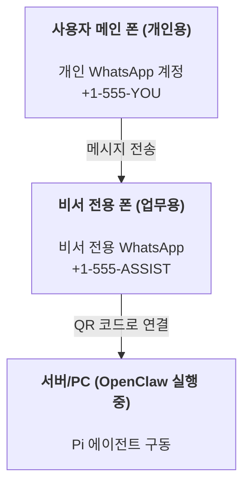

# OpenClaw로 개인 비서 구축하기

OpenClaw는 WhatsApp, Telegram, Discord, iMessage를 지원하는 **Pi** 에이전트용 통합 게이트웨이임 (플러그인 추가 시 Mattermost 지원). 이 가이드는 하나의 전용 WhatsApp 번호를 사용하여 24시간 작동하는 개인용 인공지능 비서를 구축하는 방법을 설명함.

## ⚠️ 보안 및 안전 주의사항

에이전트에게 권한을 부여한다는 것은 다음과 같은 위험 요소를 포함함:

- **시스템 명령어 실행**: Pi 도구 설정에 따라 사용자의 PC에서 직접 명령을 내릴 수 있음.
- **파일 접근**: 워크스페이스 내의 파일을 읽거나 수정할 수 있음.
- **메시지 발신**: 사용자를 대신하여 WhatsApp, Telegram 등 연결된 채널로 메시지를 전송할 수 있음.

안전한 운영을 위한 권장 사항:

- **접근 제한**: 반드시 `channels.whatsapp.allowFrom`을 설정하여 승인된 번호만 접근할 수 있게 함 (개인용 PC에서 누구나 접근 가능하게 설정하는 것은 위험함).
- **전용 번호 사용**: 개인용 계정과 분리된 비서 전용 WhatsApp 번호를 사용할 것을 권장함.
- **하트비트 신중 설정**: 하트비트 기능은 기본 30분 주기로 설정됨. 시스템이 안정화되기 전까지는 `agents.defaults.heartbeat.every: "0m"`로 설정하여 비활성화하는 것이 안전함.

## 사전 준비 사항

- OpenClaw 설치 및 온보딩 완료 ([시작하기 가이드](/start/getting-started) 참조).
- 비서용으로 사용할 별도의 전화번호 (SIM, eSIM 또는 선불폰).

## 권장 시스템 구성 (투폰 설정)

아래와 같은 구성을 추천함:



개인용 계정을 OpenClaw에 직접 연결하면 수신되는 모든 개인 메시지가 에이전트의 입력값으로 처리되어 의도치 않은 동작이 발생할 수 있음.

## 5분 빠른 시작 가이드

1. **WhatsApp Web 페어링**: 비서용 폰의 WhatsApp 앱으로 화면의 QR 코드를 스캔함.
   ```bash
   openclaw channels login
   ```

2. **Gateway 서버 실행**: 터미널을 열어 서버를 구동함 (실행 상태 유지).
   ```bash
   openclaw gateway --port 18789
   ```

3. **최소 설정 적용**: `~/.openclaw/openclaw.json` 파일에 허용할 번호를 등록함.
   ```json5
   {
     channels: { 
       whatsapp: { 
         allowFrom: ["+15555550123"] // 본인의 메인 폰 번호
       } 
     },
   }
   ```

이제 허용된 번호로 비서용 번호에 메시지를 보내 대화를 시작함. 온보딩이 완료되면 대시보드 링크가 출력됨. 인증 요청 시 `gateway.auth.token`의 값을 입력함. 이후 대시보드 재접속은 `openclaw dashboard` 명령어를 사용함.

## 에이전트 워크스페이스 (AGENTS) 설정

OpenClaw는 지정된 워크스페이스 디렉터리에서 운영 지침과 기억(Memory) 데이터를 읽어옴.

기본 경로는 `~/.openclaw/workspace`이며, 최초 실행 시 다음의 기본 파일들이 자동 생성됨: `AGENTS.md`, `SOUL.md`, `TOOLS.md`, `IDENTITY.md`, `USER.md`, `HEARTBEAT.md`. 

**팁:** 이 폴더는 에이전트의 '두뇌'와 같으므로, (비공개) Git 저장소로 관리하여 지침과 기억 데이터를 안전하게 백업하는 것이 좋음.

```bash
openclaw setup
```

상세 구조 및 백업 방법: [에이전트 워크스페이스](/concepts/agent-workspace)
기억 시스템 활용: [메모리 시스템 가이드](/concepts/memory)

## 비서 최적화 설정

기본 설정으로도 충분히 작동하지만, 상황에 맞게 다음 항목을 조정할 수 있음:

- `SOUL.md`: 에이전트의 성격 및 상세 행동 지침.
- **사고 수준(Thinking Level)**: 에이전트의 추론 깊이 기본값 설정.
- **하트비트**: 능동적인 작업 수행을 위한 주기 설정.

**설정 예시:**

```json5
{
  logging: { level: "info" },
  agent: {
    model: "anthropic/claude-3-5-sonnet-latest",
    workspace: "~/.openclaw/workspace",
    thinkingDefault: "high",
    heartbeat: { every: "30m" },
  },
  channels: {
    whatsapp: {
      allowFrom: ["+15555550123"],
      groups: { "*": { requireMention: true } }
    }
  },
  session: {
    resetTriggers: ["/new", "/reset"],
    reset: { mode: "daily", atHour: 4 }
  }
}
```

## 세션 관리 및 초기화

- **데이터 저장**: 각 세션의 상세 대화 내용은 JSONL 파일로 저장됨.
- **세션 초기화**: 채팅 창에 `/new` 또는 `/reset`을 입력하여 대화 맥락을 새로 고칠 수 있음.
- **컨텍스트 압축**: `/compact` 명령어를 통해 대화 이력을 요약하고 사용 가능한 토큰 용량을 확보함.

## 하트비트 (Proactive Mode)

OpenClaw는 주기적으로 `HEARTBEAT.md`를 읽어 스스로 할 일을 찾아 수행함.
- `HEARTBEAT.md`가 비어 있으면 리소스 절약을 위해 실행을 건너뜀.
- 특별한 이슈가 없을 때 에이전트가 `HEARTBEAT_OK`로 답하면 불필요한 알림 발송이 억제됨.

## 미디어 데이터 처리

- **수신 미디어**: `{{MediaPath}}`, `{{Transcript}}` 등의 템플릿 변수를 통해 이미지나 음성 전사 데이터를 명령에 활용함.
- **발신 미디어**: 에이전트 응답에 `MEDIA:<경로 또는 URL>` 형식을 한 줄에 입력하면 파일이 자동으로 첨부됨.

## 시스템 운영 점검

```bash
openclaw status          # 로컬 인증 및 세션 상태 확인
openclaw status --all    # 상세 진단 결과 출력
openclaw health --json   # Gateway 서버 상태 스냅샷 조회
```

로그 파일 위치: `/tmp/openclaw/openclaw-YYYY-MM-DD.log`

## 다음 단계

- **웹 제어**: [WebChat 인터페이스](/web/webchat)
- **고급 운영**: [Gateway 실행 가이드](/gateway)
- **작업 예약**: [크론(Cron) 작업 설정](/automation/cron-jobs)
- **플랫폼별 앱**: [macOS](/platforms/macos), [iOS](/platforms/ios), [Android](/platforms/android)
- **보안 강화**: [보안 아키텍처](/gateway/security)
