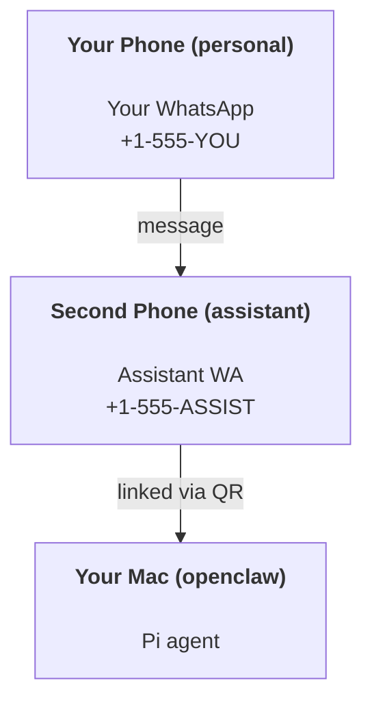

# OpenClaw로 개인 비서 만들기

OpenClaw는 **Pi** 에이전트를 위한 WhatsApp + Telegram + Discord + iMessage gateway입니다. 플러그인을 추가하면 Mattermost도 사용할 수 있습니다. 이 가이드는 "개인 비서" 구성, 즉 전용 WhatsApp 번호 하나를 항상 켜져 있는 에이전트처럼 운용하는 방법을 설명합니다.

## ⚠️ 먼저 안전부터

이 구성에서는 에이전트가 다음과 같은 위치에 놓입니다.

- 사용 중인 Pi tool 설정에 따라 사용자의 머신에서 명령을 실행할 수 있음
- 워크스페이스의 파일을 읽고 쓸 수 있음
- WhatsApp/Telegram/Discord/Mattermost (plugin)를 통해 메시지를 다시 외부로 보낼 수 있음

처음에는 보수적으로 시작하세요.

- 항상 `channels.whatsapp.allowFrom`을 설정하세요. 개인 Mac에서 누구나 접근 가능한 상태로 운영하면 안 됩니다.
- 비서용 WhatsApp 번호는 전용 번호를 사용하세요.
- Heartbeat는 이제 기본적으로 30분마다 실행됩니다. 구성을 신뢰하기 전까지는 `agents.defaults.heartbeat.every: "0m"`로 비활성화하세요.

## 사전 준비

- OpenClaw를 설치하고 온보딩을 마쳐야 합니다. 아직이라면 [Getting Started](/start/getting-started)를 먼저 참고하세요.
- 비서용 두 번째 전화번호가 필요합니다 (SIM/eSIM/선불폰)

## 투폰 구성(권장)

권장 구성은 다음과 같습니다.



개인 WhatsApp 계정을 OpenClaw에 연결하면, 나에게 오는 모든 메시지가 "agent input"이 됩니다. 대부분의 경우 원하는 동작이 아닙니다.

## 5분 빠른 시작

1. WhatsApp Web을 페어링합니다(QR이 표시되면 비서용 폰으로 스캔).

```bash
openclaw channels login
```

2. Gateway를 시작합니다(계속 실행된 상태로 둡니다).

```bash
openclaw gateway --port 18789
```

3. `~/.openclaw/openclaw.json`에 최소 설정을 넣습니다.

```json5
{
  channels: { whatsapp: { allowFrom: ["+15555550123"] } },
}
```

이제 allowlist에 등록한 폰에서 비서 번호로 메시지를 보내면 됩니다.

온보딩이 끝나면 dashboard가 자동으로 열리고 깔끔한(non-tokenized) 링크가 출력됩니다. 인증을 요구하면 Control UI 설정에 `gateway.auth.token` 값을 붙여 넣으세요. 나중에 다시 열려면 `openclaw dashboard`를 사용하면 됩니다.

## 에이전트에 워크스페이스 제공하기 (AGENTS)

OpenClaw는 워크스페이스 디렉터리에서 운영 지침과 "기억"을 읽습니다.

기본적으로 OpenClaw는 에이전트 워크스페이스로 `~/.openclaw/workspace`를 사용하며, setup/첫 agent run 시 이 디렉터리와 시작용 `AGENTS.md`, `SOUL.md`, `TOOLS.md`, `IDENTITY.md`, `USER.md`, `HEARTBEAT.md`를 자동 생성합니다. `BOOTSTRAP.md`는 워크스페이스가 완전히 새로 만들어질 때만 생성되며(삭제한 뒤 다시 생기면 안 됩니다), `MEMORY.md`는 선택 사항이라 자동 생성되지 않습니다. 하지만 파일이 있으면 일반 세션에서 로드됩니다. subagent 세션에는 `AGENTS.md`와 `TOOLS.md`만 주입됩니다.

팁: 이 폴더를 OpenClaw의 "기억"처럼 취급하고 git 저장소(가급적 비공개)로 관리해 `AGENTS.md`와 기억 파일을 백업하세요. git이 설치되어 있으면 완전히 새 워크스페이스는 자동으로 git 초기화됩니다.

```bash
openclaw setup
```

워크스페이스 전체 구조와 백업 가이드: [Agent workspace](/concepts/agent-workspace)
기억 워크플로우: [Memory](/concepts/memory)

선택 사항으로 `agents.defaults.workspace`를 사용해 다른 워크스페이스를 지정할 수 있습니다(`~` 지원).

```json5
{
  agent: {
    workspace: "~/.openclaw/workspace",
  },
}
```

이미 저장소에서 자체 워크스페이스 파일을 배포하고 있다면 bootstrap 파일 생성을 완전히 끌 수 있습니다.

```json5
{
  agent: {
    skipBootstrap: true,
  },
}
```

## "비서"처럼 동작하게 만드는 설정

OpenClaw의 기본값은 좋은 비서 구성이지만, 보통은 다음 항목을 조정하게 됩니다.

- `SOUL.md`의 페르소나/지침
- 필요하다면 thinking 기본값
- 충분히 신뢰한 뒤 heartbeat

예시:

```json5
{
  logging: { level: "info" },
  agent: {
    model: "anthropic/claude-opus-4-6",
    workspace: "~/.openclaw/workspace",
    thinkingDefault: "high",
    timeoutSeconds: 1800,
    // Start with 0; enable later.
    heartbeat: { every: "0m" },
  },
  channels: {
    whatsapp: {
      allowFrom: ["+15555550123"],
      groups: {
        "*": { requireMention: true },
      },
    },
  },
  routing: {
    groupChat: {
      mentionPatterns: ["@openclaw", "openclaw"],
    },
  },
  session: {
    scope: "per-sender",
    resetTriggers: ["/new", "/reset"],
    reset: {
      mode: "daily",
      atHour: 4,
      idleMinutes: 10080,
    },
  },
}
```

## 세션과 메모리

- Session 파일: `~/.openclaw/agents/<agentId>/sessions/{{SessionId}}.jsonl`
- Session 메타데이터(token 사용량, 마지막 route 등): `~/.openclaw/agents/<agentId>/sessions/sessions.json` (legacy: `~/.openclaw/sessions/sessions.json`)
- `/new` 또는 `/reset`은 해당 채팅에 새 세션을 시작합니다(`resetTriggers`로 설정 가능). 이 명령만 단독으로 보내면, reset이 적용되었음을 짧게 확인하는 인사 메시지를 반환합니다.
- `/compact [instructions]`는 세션 컨텍스트를 압축하고 남은 컨텍스트 예산을 알려줍니다.

## Heartbeats (proactive mode)

기본적으로 OpenClaw는 30분마다 다음 프롬프트로 heartbeat를 실행합니다.
`Read HEARTBEAT.md if it exists (workspace context). Follow it strictly. Do not infer or repeat old tasks from prior chats. If nothing needs attention, reply HEARTBEAT_OK.`
비활성화하려면 `agents.defaults.heartbeat.every: "0m"`로 설정하세요.

- `HEARTBEAT.md`가 사실상 비어 있으면(빈 줄과 `# Heading` 같은 markdown header만 있는 경우) API 호출을 아끼기 위해 heartbeat run을 건너뜁니다.
- 파일이 없더라도 heartbeat는 실행되며, 무엇을 할지는 모델이 판단합니다.
- 에이전트가 `HEARTBEAT_OK`로 응답하면(선택적으로 짧은 패딩 포함, `agents.defaults.heartbeat.ackMaxChars` 참고) 해당 heartbeat의 외부 전송은 억제됩니다.
- 기본적으로 DM 스타일 `user:<id>` 대상에는 heartbeat 전송이 허용됩니다. 실행은 유지하되 직접 대상 전달만 막고 싶다면 `agents.defaults.heartbeat.directPolicy: "block"`을 설정하세요.
- Heartbeat는 전체 agent turn을 수행하므로, 간격이 짧을수록 더 많은 토큰을 사용합니다.

```json5
{
  agent: {
    heartbeat: { every: "30m" },
  },
}
```

## 미디어 입력과 출력

들어오는 첨부파일(images/audio/docs)은 템플릿을 통해 명령에 노출할 수 있습니다.

- `{{MediaPath}}` (로컬 임시 파일 경로)
- `{{MediaUrl}}` (pseudo-URL)
- `{{Transcript}}` (audio transcription이 활성화된 경우)

에이전트가 첨부파일을 보낼 때는 줄 하나를 단독으로 `MEDIA:<path-or-url>` 형식으로 넣으면 됩니다(공백 없음). 예시:

```
Here’s the screenshot.
MEDIA:https://example.com/screenshot.png
```

OpenClaw는 이를 추출해 텍스트와 함께 미디어로 전송합니다.

## 운영 체크리스트

```bash
openclaw status          # local status (creds, sessions, queued events)
openclaw status --all    # full diagnosis (read-only, pasteable)
openclaw status --deep   # adds gateway health probes (Telegram + Discord)
openclaw health --json   # gateway health snapshot (WS)
```

로그는 `/tmp/openclaw/` 아래에 저장됩니다(기본값: `openclaw-YYYY-MM-DD.log`).

## 다음 단계

- WebChat: [WebChat](/web/webchat)
- Gateway 운영: [Gateway runbook](/gateway)
- Cron + wakeups: [Cron jobs](/automation/cron-jobs)
- macOS 메뉴 막대 컴패니언: [OpenClaw macOS app](/platforms/macos)
- iOS node 앱: [iOS app](/platforms/ios)
- Android node 앱: [Android app](/platforms/android)
- Windows 현황: [Windows (WSL2)](/platforms/windows)
- Linux 현황: [Linux app](/platforms/linux)
- 보안: [Security](/gateway/security)
