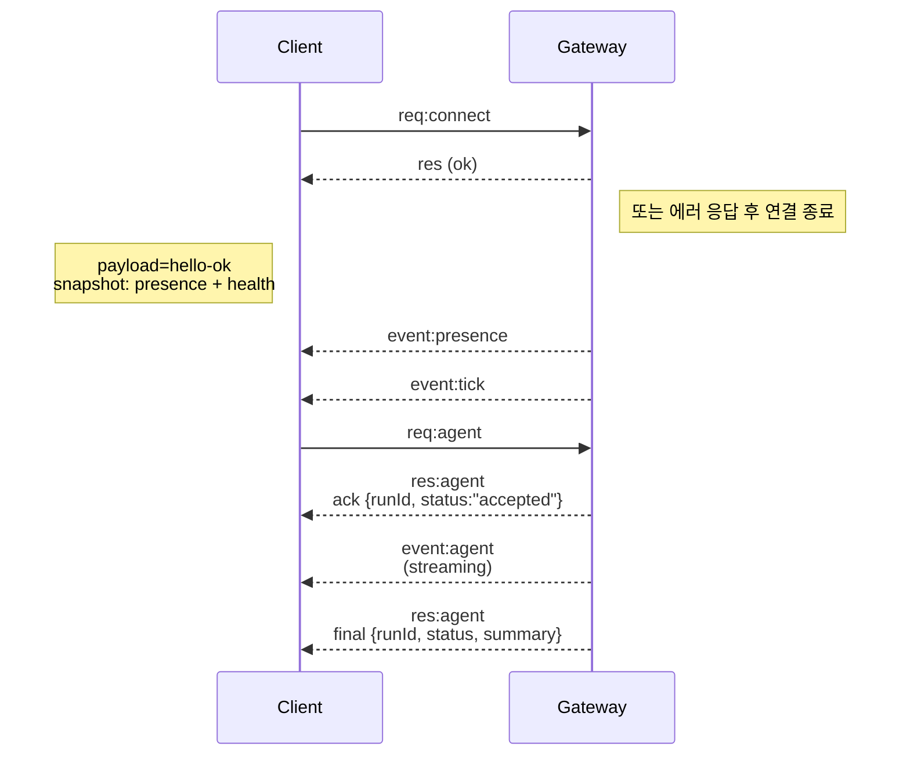

# 게이트웨이 아키텍처

최종 업데이트: 2026-01-22

## 개요

* 단일 장기 실행 프로세스인 \*\*게이트웨이(Gateway)\*\*가 모든 메시징 채널(WhatsApp via Baileys, Telegram via grammY, Slack, Discord, Signal, iMessage, WebChat 등)을 관리합니다.
* 제어 평면 클라이언트(macOS 앱, CLI, 웹 UI, 자동화 도구 등)는 설정된 호스트의 **WebSocket**을 통해 게이트웨이에 연결됩니다 (기본값: `127.0.0.1:18789`).
* **노드(Nodes)** (macOS/iOS/Android/Headless 등) 역시 **WebSocket**으로 연결되지만, 명시적인 권한 및 명령 세트(caps/commands)와 함께 `role: node`를 선언합니다.
* 호스트당 하나의 게이트웨이만 실행되며, 이는 해당 호스트에서 WhatsApp 세션을 열 수 있는 유일한 주체입니다.
* **Canvas 호스트**는 게이트웨이 HTTP 서버를 통해 다음 경로로 제공됩니다.
  * `/__openclaw__/canvas/`: 에이전트가 편집 가능한 HTML/CSS/JS 리소스
  * `/__openclaw__/a2ui/`: A2UI 호스트
    두 서비스 모두 게이트웨이와 동일한 포트(기본값: `18789`)를 사용합니다.

## 구성 요소 및 흐름

### 게이트웨이 (데몬)

* 각 서비스 제공업체와의 연결을 유지 관리합니다.
* 타입이 지정된 WS API(요청, 응답, 서버 푸시 이벤트)를 제공합니다.
* 유입되는 데이터 프레임을 JSON Schema를 통해 검증합니다.
* `agent`, `chat`, `presence`, `health`, `heartbeat`, `cron` 등의 이벤트를 발생시킵니다.

### 클라이언트 (macOS 앱 / CLI / 웹 관리자)

* 각 클라이언트당 하나의 WS 연결을 가집니다.
* 요청(`health`, `status`, `send`, `agent`, `system-presence` 등)을 전송합니다.
* 이벤트(`tick`, `agent`, `presence`, `shutdown` 등)를 구독합니다.

### 노드 (macOS / iOS / Android / Headless)

* `role: node` 역할을 가지고 **동일한 WS 서버**에 연결합니다.
* 연결(`connect`) 시 장치 식별 정보(Device Identity)를 제공합니다. 페어링은 **장치 기반**(`role: node`)으로 이루어지며, 승인 정보는 장치 페어링 저장소에 관리됩니다.
* `canvas.*`, `camera.*`, `screen.record`, `location.get` 등의 명령 인터페이스를 노출합니다.

상세 프로토콜 정보: [게이트웨이 프로토콜](/gateway/protocol)

### 웹 채팅 (WebChat)

* 게이트웨이 WS API를 사용하여 채팅 내역을 조회하고 메시지를 전송하는 정적 UI입니다.
* 원격 설정 환경에서는 다른 클라이언트와 마찬가지로 SSH 또는 Tailscale 터널을 통해 연결합니다.

## 연결 수명 주기 (단일 클라이언트 예시)



## 와이어 프로토콜 (Wire Protocol 요약)

* 전송 방식: WebSocket, JSON 페이로드를 포함한 텍스트 프레임.
* 첫 번째 프레임은 반드시 `connect`여야 합니다.
* 핸드셰이크 완료 후:
  * 요청(Requests): `{type:"req", id, method, params}` → 응답(Responses): `{type:"res", id, ok, payload|error}`
  * 이벤트(Events): `{type:"event", event, payload, seq?, stateVersion?}`
* `OPENCLAW_GATEWAY_TOKEN` (또는 `--token`) 설정 시, `connect.params.auth.token` 값이 일치해야 하며 그렇지 않을 경우 소켓 연결이 즉시 종료됩니다.
* 부작용을 동반하는 메서드(`send`, `agent` 등)에는 안전한 재시도를 위해 \*\*멱등성 키(Idempotency keys)\*\*가 필요합니다. 서버는 짧은 수명의 중복 제거(Dedupe) 캐시를 운영합니다.
* 노드는 `connect` 시 반드시 `role: "node"`와 함께 권한(caps/commands/permissions) 정보를 포함해야 합니다.

## 페어링 및 로컬 신뢰

* 모든 WS 클라이언트(운영자 및 노드)는 연결 시 **장치 식별 정보**를 포함합니다.
* 새로운 장치 ID는 페어링 승인이 필요하며, 게이트웨이는 이후 연결을 위한 \*\*장치 토큰(Device Token)\*\*을 발급합니다.
* **로컬** 연결(루프백 주소 또는 게이트웨이 호스트 자신의 Tailscale 주소)은 원활한 사용자 경험을 위해 자동으로 승인될 수 있습니다.
* 모든 연결 시 `connect.challenge` 논스(Nonce)에 대한 서명이 필요합니다.
* `v3` 서명 페이로드는 `platform` 및 `deviceFamily` 정보도 함께 바인딩합니다. 게이트웨이는 재연결 시 페어링된 메타데이터를 고정하며, 정보 변경 시 재페어링(Repair pairing)을 요구합니다.
* **비로컬(Non-local)** 연결은 여전히 명시적인 승인 절차가 필요합니다.
* 게이트웨이 인증 설정(`gateway.auth.*`)은 로컬 및 원격 연결 **모두**에 동일하게 적용됩니다.

자세한 내용: [게이트웨이 프로토콜](/gateway/protocol), [페어링](/channels/pairing), [보안](/gateway/security) 문서 참조.

## 프로토콜 정의 및 코드 생성

* TypeBox 스키마를 통해 프로토콜을 정의합니다.
* 해당 스키마로부터 JSON Schema가 생성됩니다.
* 생성된 JSON Schema를 바탕으로 Swift 모델 등이 자동으로 생성됩니다.

## 원격 액세스

* 권장 방식: Tailscale 또는 VPN 활용.

* 대안 방식: SSH 터널링

  ```bash
  ssh -N -L 18789:127.0.0.1:18789 user@host
  ```

* 터널을 통한 연결 시에도 동일한 핸드셰이크 및 인증 토큰이 적용됩니다.

* 원격 설정 환경에서는 WebSocket에 TLS 및 선택적 인증서 핀닝(Pinning)을 활성화할 수 있습니다.

## 운영 스냅샷

* 시작: `openclaw gateway` (포그라운드 실행, 로그는 표준 출력으로 출력됨).
* 상태 확인: WS를 통한 `health` 요청 (또는 `hello-ok` 응답에 포함된 정보 확인).
* 프로세스 관리: 자동 재시작을 위해 launchd 또는 systemd 사용 권장.

## 불변 조건 (Invariants)

* 호스트당 정확히 하나의 게이트웨이 프로세스만 단일 Baileys 세션을 제어합니다.
* 핸드셰이크는 필수이며, JSON 형식이 아니거나 첫 프레임이 `connect`가 아닌 경우 연결이 강제 종료됩니다.
* 이벤트는 재생되지 않으므로, 데이터 누락이 의심되는 경우 클라이언트는 정보를 새로고침해야 합니다.
