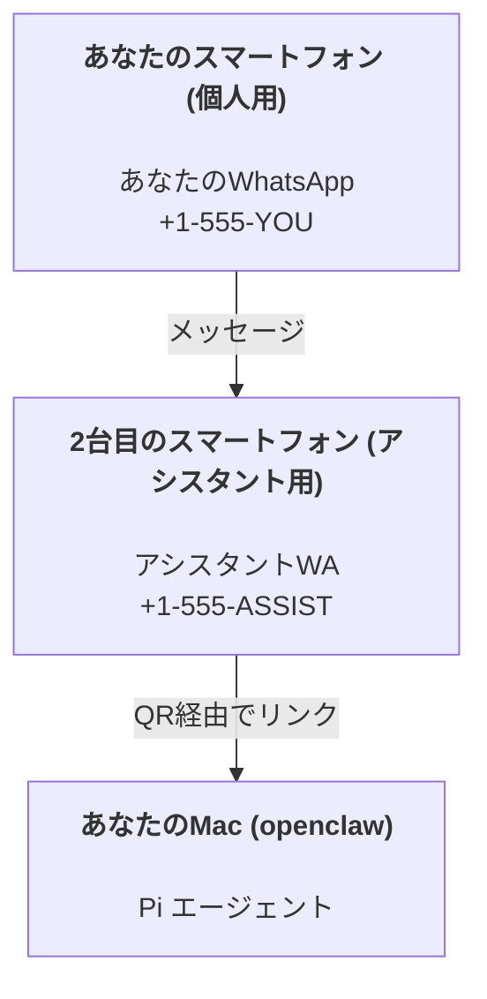

OpenClaw は、**Pi** エージェントのための WhatsApp + Telegram + Discord + iMessage ゲートウェイです。プラグインで Mattermost を追加できます。このガイドは「パーソナルアシスタント」のセットアップです。1つの専用の WhatsApp 番号が、常時稼働するアシスタントのように振る舞います。

## ⚠️ 安全第一

あなたはエージェントを以下のことができる位置に置いています：

- マシン上でコマンドを実行する（Pi ツールのセットアップに依存）
- ワークスペース内のファイルの読み取り/書き込み
- WhatsApp/Telegram/Discord/Mattermost (プラグイン) を介したメッセージの送信

保守的に始めてください：

- 常に `channels.whatsapp.allowFrom` を設定してください（個人の Mac で世界中からアクセス可能な状態で実行しないでください）。
- アシスタント用に専用の WhatsApp 番号を使用してください。
- 現在、ハートビートはデフォルトで30分ごとに設定されています。セットアップを信頼できるようになるまでは、`agents.defaults.heartbeat.every: "0m"` を設定して無効にしてください。

## 前提条件

- OpenClaw のインストールとオンボーディングの完了 — まだ行っていない場合は [はじめに](/start/getting-started) を参照してください
- アシスタント用の2つ目の電話番号（SIM / eSIM / プリペイド）

## 2台のスマートフォンによるセットアップ (推奨)

この構成をお勧めします：



個人の WhatsApp を OpenClaw にリンクすると、あなた宛のすべてのメッセージが「エージェントの入力」になってしまいます。それはほとんどの場合、望んでいることではありません。

## 5分間クイックスタート

1. WhatsApp Web をペアリングします（QR が表示されるので、アシスタントのスマートフォンでスキャンします）：

```bash
openclaw channels login
```

2. Gateway を起動します（実行したままにします）：

```bash
openclaw gateway --port 18789
```

3. 最小限の設定を `~/.openclaw/openclaw.json` に記述します：

```json5
{
  channels: { whatsapp: { allowFrom: ["+15555550123"] } },
}
```

これで、許可リストに登録されたスマートフォンからアシスタントの番号にメッセージを送信できます。

オンボーディングが完了すると、自動的にダッシュボードが開き、クリーンな（トークン化されていない）リンクが表示されます。認証を求められた場合は、`gateway.auth.token` のトークンを Control UI の設定に貼り付けてください。後でもう一度開くには、`openclaw dashboard` を実行します。

## エージェントにワークスペースを与える (AGENTS)

OpenClaw は、そのワークスペースディレクトリから運用指示と「記憶」を読み取ります。

デフォルトでは、OpenClaw はエージェントのワークスペースとして `~/.openclaw/workspace` を使用し、セットアップ時やエージェントの初回実行時に自動的に作成します（スターターの `AGENTS.md`、`SOUL.md`、`TOOLS.md`、`IDENTITY.md`、`USER.md`、`HEARTBEAT.md` も一緒に作成されます）。`BOOTSTRAP.md` はワークスペースが真新しい場合にのみ作成されます（削除した後に戻ってくることはありません）。`MEMORY.md` はオプションであり（自動作成されません）、存在する場合は通常のセッション用に読み込まれます。サブエージェントのセッションでは、`AGENTS.md` と `TOOLS.md` のみが注入されます。

ヒント：このフォルダを OpenClaw の「記憶」として扱い、git リポジトリ（理想的にはプライベート）にすることで、`AGENTS.md` とメモリファイルがバックアップされるようにしてください。git がインストールされている場合、真新しいワークスペースは自動的に初期化されます。

```bash
openclaw setup
```

完全なワークスペースのレイアウトとバックアップガイド：[エージェントワークスペース](/concepts/agent-workspace)
メモリのワークフロー：[メモリ](/concepts/memory)

オプション：`agents.defaults.workspace` で別のワークスペースを選択します（`~` をサポートしています）。

```json5
{
  agent: {
    workspace: "~/.openclaw/workspace",
  },
}
```

リポジトリから独自のワークスペースファイルをすでに提供している場合は、ブートストラップファイルの作成を完全に無効にすることができます：

```json5
{
  agent: {
    skipBootstrap: true,
  },
}
```

## それを「アシスタント」に変える設定

OpenClaw のデフォルトは優れたアシスタントのセットアップになっていますが、通常は以下を調整することになります：

- `SOUL.md` におけるペルソナ / 指示
- 思考のデフォルト（必要に応じて）
- ハートビート（信頼できるようになってから）

例：

```json5
{
  logging: { level: "info" },
  agent: {
    model: "anthropic/claude-opus-4-6",
    workspace: "~/.openclaw/workspace",
    thinkingDefault: "high",
    timeoutSeconds: 1800,
    // 0から始め、後で有効にします。
    heartbeat: { every: "0m" },
  },
  channels: {
    whatsapp: {
      allowFrom: ["+15555550123"],
      groups: {
        "*": { requireMention: true },
      },
    },
  },
  routing: {
    groupChat: {
      mentionPatterns: ["@openclaw", "openclaw"],
    },
  },
  session: {
    scope: "per-sender",
    resetTriggers: ["/new", "/reset"],
    reset: {
      mode: "daily",
      atHour: 4,
      idleMinutes: 10080,
    },
  },
}
```

## セッションとメモリ

- セッションファイル：`~/.openclaw/agents/<agentId>/sessions/{{SessionId}}.jsonl`
- セッションのメタデータ（トークン使用量、最後のルートなど）：`~/.openclaw/agents/<agentId>/sessions/sessions.json`（旧：`~/.openclaw/sessions/sessions.json`）
- `/new` または `/reset` は、そのチャットの新しいセッションを開始します（`resetTriggers` 経由で設定可能）。単独で送信された場合、エージェントはリセットを確認するために短い挨拶で返信します。
- `/compact [instructions]` はセッションコンテキストを圧縮し、残りのコンテキスト予算を報告します。

## ハートビート（プロアクティブモード）

デフォルトでは、OpenClaw は30分ごとに以下のプロンプトでハートビートを実行します：
`存在する場合、HEARTBEAT.mdを読み取ります（ワークスペースコンテキスト）。それに厳密に従ってください。過去のチャットから古いタスクを推測したり繰り返したりしないでください。注意が必要なことが何もない場合は、HEARTBEAT_OK と返信してください。`
無効にするには `agents.defaults.heartbeat.every: "0m"` を設定します。

- `HEARTBEAT.md` は存在するが、実質的に空である（空白行と `# Heading` のようなマークダウンヘッダーのみ）場合、OpenClaw は API 呼び出しを節約するためにハートビートの実行をスキップします。
- ファイルが欠落している場合でも、ハートビートは実行され、モデルが何をすべきかを決定します。
- エージェントが `HEARTBEAT_OK` と返信した場合（オプションで短いパディングを使用できます。`agents.defaults.heartbeat.ackMaxChars` を参照）、OpenClaw はそのハートビートの外部への配信を抑制します。
- デフォルトでは、DM スタイルの `user:<id>` ターゲットへのハートビートの配信は許可されています。ハートビートの実行はアクティブにしたまま、ダイレクトターゲットへの配信を抑制するには、`agents.defaults.heartbeat.directPolicy: "block"` を設定します。
- ハートビートはエージェントのフルターンを実行します — 間隔を短くするとより多くのトークンを消費します。

```json5
{
  agent: {
    heartbeat: { every: "30m" },
  },
}
```

## メディアの入出力

受信した添付ファイル（画像/音声/ドキュメント）は、テンプレートを介してコマンドに表示できます：

- `{{MediaPath}}`（ローカルの一時ファイルパス）
- `{{MediaUrl}}`（疑似URL）
- `{{Transcript}}`（音声書き起こしが有効な場合）

エージェントからの送信添付ファイル：その行に単独で `MEDIA:<path-or-url>` を含めます（スペースなし）。例：

```
ここにスクリーンショットがあります。
MEDIA:https://example.com/screenshot.png
```

OpenClaw はこれらを抽出し、テキストと一緒にメディアとして送信します。

## 運用チェックリスト

```bash
openclaw status          # ローカルステータス（資格情報、セッション、キューに入っているイベント）
openclaw status --all    # 完全な診断（読み取り専用、貼り付け可能）
openclaw status --deep   # ゲートウェイのヘルスプローブを追加（Telegram + Discord）
openclaw health --json   # ゲートウェイヘルスのスナップショット（WS）
```

ログは `/tmp/openclaw/` の下に配置されます（デフォルト：`openclaw-YYYY-MM-DD.log`）。

## 次のステップ

- WebChat: [WebChat](/web/webchat)
- ゲートウェイの運用: [Gateway ランブック](/gateway)
- Cron + ウェイクアップ: [Cron ジョブ](/automation/cron-jobs)
- macOS メニューバーコンパニオン: [OpenClaw macOS アプリ](/platforms/macos)
- iOS ノードアプリ: [iOS アプリ](/platforms/ios)
- Android ノードアプリ: [Android アプリ](/platforms/android)
- Windows ステータス: [Windows (WSL2)](/platforms/windows)
- Linux ステータス: [Linux アプリ](/platforms/linux)
- セキュリティ: [セキュリティ](/gateway/security)
